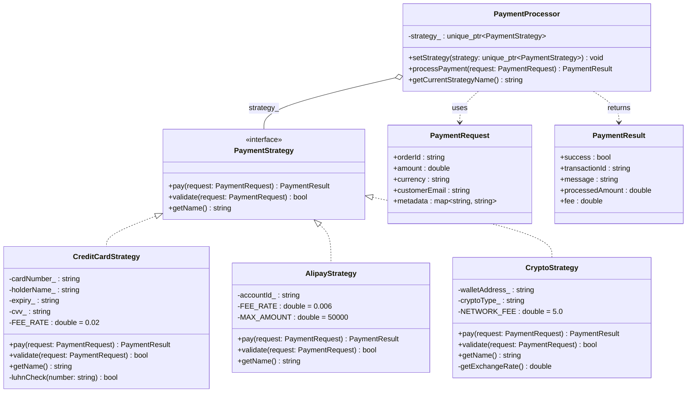
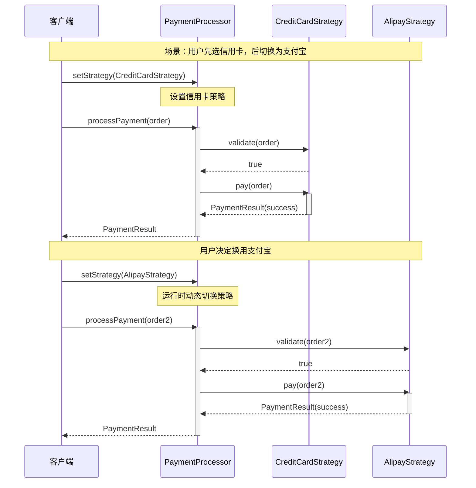

# 策略模式（Strategy Pattern）

## 模式分类

> **组件协作（Component Collaboration）**
>
> 策略模式属于"组件协作"分类。在软件构建过程中，某些对象使用的算法可能多种多样、经常变化。
> 策略模式通过将算法封装为独立对象，使其可以在运行时被动态替换，实现了**算法提供者与算法使用者之间的协作**。
> 与模板方法通过继承实现协作不同，策略模式通过**组合**实现协作，具有更高的灵活性。

## 问题背景

> 假设我们正在开发一个电商平台的支付系统。平台需要支持多种支付方式：信用卡、支付宝、加密货币等。
>
> 最直接的实现方式是在支付处理代码中使用大量的 `if-else` 或 `switch-case`：
> ```cpp
> if (paymentType == "credit_card") {
>     // 信用卡支付逻辑（50 行代码）
> } else if (paymentType == "alipay") {
>     // 支付宝支付逻辑（50 行代码）
> } else if (paymentType == "crypto") {
>     // 加密货币支付逻辑（50 行代码）
> }
> ```
>
> 这种方法的问题：
> 1. **违反开闭原则**：每新增一种支付方式，都要修改已有代码
> 2. **代码膨胀**：支付处理类越来越庞大
> 3. **难以测试**：无法独立测试单种支付方式
> 4. **无法运行时切换**：用户在结算页面更换支付方式时，需要重新走完整流程

## 模式意图

> **GoF 定义**：Define a family of algorithms, encapsulate each one, and make them interchangeable.
> Strategy lets the algorithm vary independently from clients that use it.
>
> **通俗解释**：策略模式就像手机上的移动支付——你的手机（上下文）可以安装多个支付 App
> （策略对象），结账时选择用哪个 App 支付即可。添加新的支付 App 不需要换手机，
> 切换支付方式也只需点几下屏幕。

## 类图



## 时序图



## 要点解析

### 1. 组合优于继承

策略模式使用组合（`PaymentProcessor` 持有 `PaymentStrategy` 指针）而非继承来实现算法的多态。
这使得策略可以在运行时动态切换，而继承关系在编译时就已固定。

### 2. 消除条件分支

将散落在 `if-else` / `switch-case` 中的算法逻辑提取为独立的策略类，
每个类专注于一种算法实现，符合**单一职责原则**。

### 3. 运行时切换

`setStrategy()` 方法允许在运行时替换算法，这是策略模式与模板方法模式的最大区别。
在电商场景中，用户可以在结算页面随时切换支付方式。

### 4. 接口隔离

`PaymentStrategy` 接口只暴露 `pay()` 和 `validate()` 两个方法，
客户端无需了解每种支付方式的内部细节（卡号、钱包地址等），实现了信息隐藏。

### 5. 与工厂模式协作

通过 `createPaymentStrategy()` 工厂函数，可以根据配置字符串动态创建策略对象，
进一步将策略的创建与使用解耦。

## 示例代码说明

本目录下的示例代码演示了一个电商支付系统场景：

- **`Strategy.h`**：定义了策略接口 `PaymentStrategy`，三个具体策略类 `CreditCardStrategy`、`AlipayStrategy`、`CryptoStrategy`，以及上下文类 `PaymentProcessor`。

- **`Strategy.cpp`**：
  - `CreditCardStrategy`：模拟信用卡支付流程，包含 Luhn 校验、3D Secure 验证、2% 手续费计算。
  - `AlipayStrategy`：模拟支付宝扫码支付，包含单笔限额校验（50000 元）、0.6% 手续费。
  - `CryptoStrategy`：模拟加密货币支付，包含汇率换算、区块链确认流程、固定网络手续费。
  - `PaymentProcessor`：演示运行时动态切换支付策略。
  - `main()` 函数展示了五个场景：信用卡支付、切换为支付宝、使用加密货币、工厂函数创建策略、验证失败的情况。

## 开源项目中的应用

| 项目 | 类/方法 | 说明 |
|------|---------|------|
| **C++ STL** | `std::sort` 的比较函数对象 | 排序策略可通过函数对象、Lambda 表达式自定义 |
| **C++ STL** | `std::allocator` | 容器的内存分配策略可替换 |
| **Boost** | `boost::function` | 将可调用对象封装为策略 |
| **Qt Framework** | `QLayout` 体系 | 不同布局策略（QHBoxLayout, QVBoxLayout, QGridLayout） |
| **LLVM** | `ScheduleDAGInstrs` | 指令调度策略可替换 |
| **OpenCV** | 特征检测器 | `FeatureDetector` 接口的不同实现（ORB, SIFT, SURF） |

## 适用场景与注意事项

### 适用场景
- 需要在运行时动态选择算法（如支付方式、排序算法、压缩算法）
- 有多种相似的算法，它们之间只有行为上的差异
- 需要避免暴露复杂的、与算法相关的数据结构
- 类中有大量的条件语句用于选择不同的行为

### 不适用场景
- 算法很少改变且数量固定（简单的条件分支可能更清晰）
- 客户端必须了解所有策略的差异才能选择合适的策略（这违背了封装的初衷）
- 只有两三种算法且不太可能增加（过度设计）

### 与其他模式的对比

| 对比维度 | 策略模式 | 模板方法 | 状态模式 |
|----------|----------|----------|----------|
| 替换对象 | 整个算法 | 算法中的某些步骤 | 对象的行为随状态变化 |
| 实现机制 | 组合 + 委托 | 继承 + 覆写 | 组合 + 委托 |
| 切换时机 | 客户端主动切换 | 编译时确定 | 状态自动转换 |
| 客户端感知 | 客户端选择策略 | 客户端选择子类 | 客户端通常不感知切换 |
| 意图 | 替换"怎么做" | 固定"做什么"，变化"怎么做" | 行为随内部状态自动改变 |
