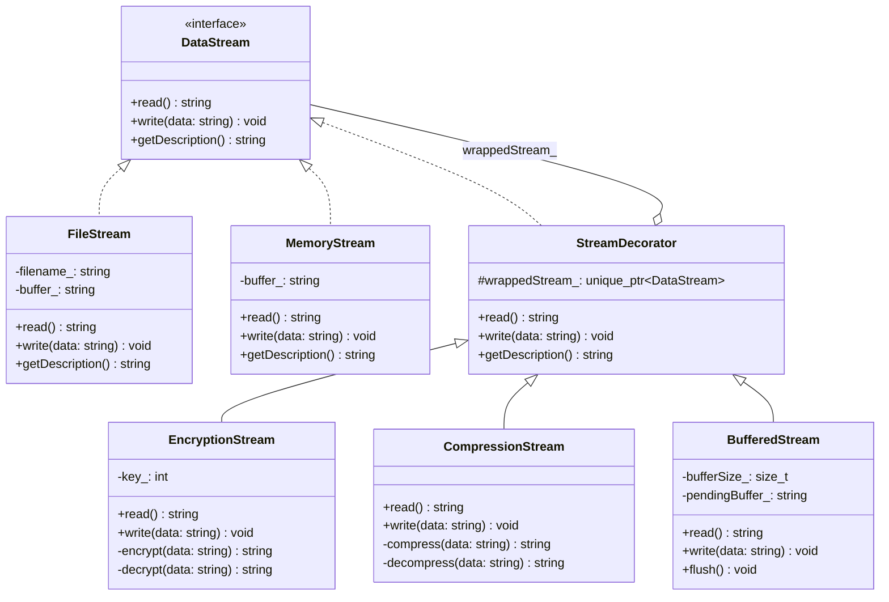
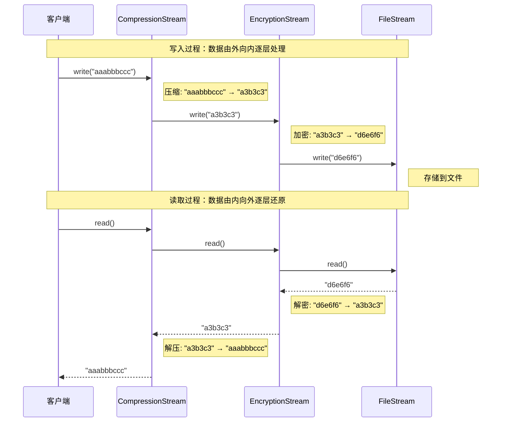

# 装饰器模式（Decorator Pattern）

## 模式分类

> **归属于"单一职责"分类。**
>
> 装饰器模式的核心价值在于：每个装饰器只承担一种增强职责（加密、压缩、缓冲等），而不是把所有功能堆砌在同一个类中。通过将不同的职责分离到独立的装饰器类中，每个类都遵循单一职责原则。如果需要修改加密算法，只需改动 `EncryptionStream`；如果需要调整缓冲策略，只需改动 `BufferedStream`——各个增强功能互不影响。

## 问题背景

> 假设我们正在开发一个数据流处理系统。最初只有简单的文件读写功能，但随着需求增长，需要支持：
>
> - **加密传输**：敏感数据在写入前加密、读取后解密
> - **数据压缩**：大数据流写入前压缩、读取后解压
> - **缓冲管理**：小数据累积到一定量后批量写入以提高性能
>
> 如果用继承来实现，会产生组合爆炸：`EncryptedFileStream`、`CompressedFileStream`、`BufferedEncryptedFileStream`、`BufferedCompressedEncryptedMemoryStream`……类的数量随功能组合指数增长。更糟糕的是，新增一种增强功能（如日志记录），所有已有的组合类都需要重新排列。

## 模式意图

> **GoF 定义：** 动态地给一个对象添加一些额外的职责。就增加功能来说，装饰器模式相比生成子类更为灵活。
>
> **通俗解释：** 装饰器就像俄罗斯套娃——每一层都包裹着内层对象，在转发调用的前后加入自己的处理逻辑。外界看到的始终是同一个接口，但实际行为被逐层增强。关键在于装饰器本身也实现了被装饰对象的接口，所以可以无限叠加。

## 类图

## 时序图

## 要点解析

### 1. 统一的组件接口（DataStream）

装饰器能够叠加的前提是：装饰器和被装饰对象实现同一个接口。`DataStream` 定义了 `read()`、`write()` 和 `getDescription()` 三个纯虚函数，所有具体流和装饰器都实现这个接口。客户端代码只依赖 `DataStream` 接口，无需知道对象是否被装饰、被装饰了多少层。

### 2. 装饰器基类的转发机制（StreamDecorator）

`StreamDecorator` 持有一个 `std::unique_ptr<DataStream>` 成员，其默认实现是将所有调用直接转发给被包裹的对象。子类只需覆盖感兴趣的方法，在转发前后插入自己的处理逻辑即可。这种设计避免了每个具体装饰器都要重复编写转发代码。

### 3. 所有权语义（unique_ptr）

使用 `std::unique_ptr` 表达了清晰的所有权关系：每个装饰器独占其内部流对象。构造时使用 `std::move` 转移所有权，保证资源管理的安全性，不会出现悬挂指针或内存泄漏。

### 4. 装饰顺序的重要性

装饰器的叠加顺序决定了数据处理的管道。例如 `Compression(Encryption(FileStream))` 意味着写入时先压缩再加密，读取时先解密再解压。顺序不同，最终存储在文件中的数据格式也不同。这是使用装饰器时需要特别注意的地方。

### 5. 运行时动态组合

与继承不同，装饰器可以在运行时根据配置参数动态组合。示例代码中的场景5展示了如何根据布尔标志灵活地选择启用哪些装饰层，这在实际的配置驱动系统中非常实用。

## 示例代码说明

本目录下的代码实现了一个数据流处理的装饰器模式：

- **Decorator.h** — 定义了完整的类层次结构：
  - `DataStream`：抽象接口
  - `FileStream` / `MemoryStream`：两种具体的数据流实现
  - `StreamDecorator`：装饰器基类，持有 `unique_ptr<DataStream>`
  - `EncryptionStream`：使用凯撒密码进行加密/解密
  - `CompressionStream`：使用游程编码（RLE）进行压缩/解压
  - `BufferedStream`：累积数据到阈值后批量写入，析构时自动刷新

- **Decorator.cpp** — 实现所有类并包含5个演示场景：
  1. 基础文件流（无装饰）——展示最简单的读写
  2. 加密文件流——单层装饰
  3. 压缩 + 加密叠加装饰——多层装饰，展示数据逐层变换
  4. 缓冲 + 加密 + 内存流——展示缓冲区的累积和刷新机制
  5. 运行时动态组合——根据配置标志动态构建装饰器管道

## 开源项目中的应用

| 项目 | 应用场景 |
|------|----------|
| **Java I/O 库** | 经典的装饰器应用：`BufferedInputStream(new FileInputStream(...))` 就是装饰器模式。C++ 的 iostream 虽然设计思路不同，但 Java I/O 流是最著名的装饰器模式教科书案例 |
| **Qt Framework** | `QIODevice` 体系中，`QBuffer`、`QFile` 是具体组件，`QDataStream` 和 `QTextStream` 充当装饰器角色，为底层设备提供结构化的读写能力 |
| **Boost.Iostreams** | `boost::iostreams::filtering_stream` 允许将多个过滤器（压缩、加密、格式转换）链接到一个流上，是典型的装饰器模式 |
| **LLVM** | `raw_ostream` 层次结构中，`raw_fd_ostream`、`raw_string_ostream` 等可通过 `formatted_raw_ostream` 装饰来获得格式化输出能力 |
| **gRPC** | 拦截器（Interceptor）机制本质上是装饰器模式——在 RPC 调用链上叠加认证、日志、监控等横切关注点 |

## 适用场景与注意事项

### 何时使用

- 需要在不修改已有类的前提下，动态地、透明地给对象添加功能
- 功能增强的组合数量很多，用继承会导致类爆炸
- 需要在运行时根据配置动态决定启用哪些功能
- 各个增强功能之间相互独立，可以自由叠加

### 何时不用

- 如果只有一两种固定的组合，直接用子类更简单直接
- 当装饰器需要访问具体组件的特有方法（而非接口定义的方法）时，装饰器模式不太适用
- 装饰器层数过多时，调试和错误追踪会变得困难

### 与其他模式的对比

| 对比维度 | 装饰器模式 | 代理模式 | 适配器模式 |
|----------|-----------|---------|-----------|
| **目的** | 动态增强功能 | 控制访问 | 转换接口 |
| **接口关系** | 装饰器与组件实现同一接口 | 代理与真实对象实现同一接口 | 适配器实现目标接口，内部持有被适配对象 |
| **组合方式** | 可多层叠加 | 通常单层 | 单层 |
| **关注点** | 增加行为 | 控制行为 | 兼容行为 |
