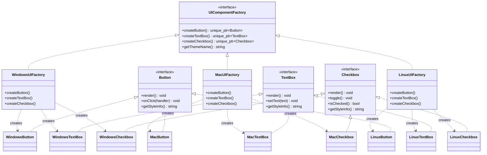
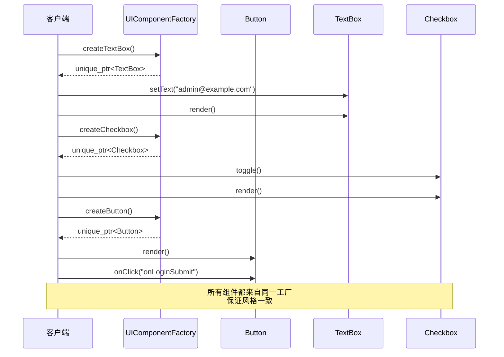

# 抽象工厂模式（Abstract Factory）

## 模式分类
> 归属于 **"对象创建"** 分类。抽象工厂模式提供了一个创建 **一系列相关或相互依赖对象** 的接口，而无需指定它们的具体类。与工厂方法（创建单个产品）不同，抽象工厂关注的是 **产品族** 的整体一致性。

## 问题背景
> 你在开发一个跨平台的桌面应用程序，需要为 Windows、macOS、Linux 提供原生外观的 UI 组件（按钮、文本框、复选框等）。
>
> 问题在于：
> - 每个平台的 UI 风格完全不同（Windows Fluent vs macOS Aqua vs GTK）
> - **同一界面中的组件必须属于同一风格**——你不能混用 Windows 按钮和 macOS 复选框
> - 客户端代码不应依赖具体平台的组件类，否则每次新增平台都需要大面积修改
> - 需要一种机制确保 **一族组件的风格一致性**

## 模式意图
> **GoF 定义**：提供一个创建一系列相关或相互依赖对象的接口，而无需指定它们的具体类。
>
> **通俗解释**：抽象工厂就像一个"主题包"——选择了 Windows 主题，所有组件（按钮、输入框、复选框）都自动变成 Windows 风格。客户端只需要选择一个工厂，后续创建的所有组件都保证风格统一。

## 类图

## 时序图

## 要点解析

1. **产品族的一致性保证**：这是抽象工厂的核心价值。`WindowsUIFactory` 只创建 Windows 风格的组件，不可能混入 macOS 的按钮。编译器级别的类型安全确保了这一点。

2. **与工厂方法的区别**：工厂方法关注的是"一个产品的创建"，抽象工厂关注的是"一族相关产品的创建"。抽象工厂内部的每个方法实际上就是一个工厂方法。

3. **新增产品族容易，新增产品种类困难**：要新增一个平台（如 Android），只需添加一个新的具体工厂和对应的组件类。但如果要给所有平台新增一种组件（如 Slider），则需要修改抽象工厂接口和所有具体工厂——这是抽象工厂的固有局限。

4. **智能指针的使用**：工厂方法返回 `std::unique_ptr`，明确了对象所有权归调用者。组件的生命周期由客户端管理，工厂不持有任何引用。

5. **客户端完全解耦**：`buildLoginForm()` 函数只依赖抽象的 `UIComponentFactory`、`Button`、`TextBox`、`Checkbox` 接口，可以搭配任何平台的具体工厂使用。

## 示例代码说明

- **`AbstractFactory.h`**：定义了三组抽象产品（Button、TextBox、Checkbox）、三套具体实现（Windows/Mac/Linux 各一套）、抽象工厂及其三个具体工厂。
- **`AbstractFactory.cpp`**：
  - 每个平台的组件实现各自独特的渲染效果（如 Windows 使用方形复选框 `[X]`，macOS 使用圆形 `(v)`，Linux 使用 GTK 风格 `[*]`）。
  - `buildLoginForm()` 展示了用同一段客户端代码构建不同风格的登录表单。
  - `main()` 遍历三个平台，依次展示各自风格的完整登录表单。

## 开源项目中的应用

| 项目 | 应用场景 |
|------|----------|
| **Qt Framework** | `QPlatformTheme` 和 `QPlatformIntegration` 为不同平台创建原生样式的对话框、菜单、图标等一族相关对象 |
| **wxWidgets** | 根据编译平台选择 `wxMSW`/`wxGTK`/`wxOSX` 工厂，创建一整套原生 UI 控件 |
| **Boost.Asio** | `io_context` 根据操作系统选择不同的 I/O 多路复用实现（epoll/kqueue/IOCP），这些实现构成一个产品族 |
| **LLVM** | `TargetRegistry` 为每种目标架构创建一整套相关的代码生成组件（汇编器、反汇编器、目标描述等） |
| **Chromium** | `PlatformWindow` 系列类为不同操作系统创建配套的窗口、渲染表面、输入处理等组件 |

## 适用场景与注意事项

### 适用场景
- 系统需要独立于产品的创建、组合和表示
- 系统需要由多个产品系列中的一个来配置
- 需要强制保证一族相关产品的一致性（不能混搭）
- 需要在运行时切换整个产品族（如换肤、换主题）

### 不适用场景
- 只需要创建单个产品——使用工厂方法即可
- 产品之间没有关联性——没有必要强制它们通过同一工厂创建
- 产品种类（如组件类型）经常变化——每次新增产品都需要修改所有工厂

### 与其他模式的对比
| 对比维度 | 抽象工厂 | 工厂方法 | Builder |
|----------|----------|----------|---------|
| 创建对象的数量 | 一族相关对象 | 单个对象 | 一个复杂对象 |
| 关注点 | 产品族一致性 | 单一产品的创建延迟 | 复杂对象的构建步骤 |
| 扩展产品族 | 容易（新增具体工厂） | 容易 | 不涉及 |
| 扩展产品种类 | 困难（修改所有工厂） | 不涉及 | 灵活 |
