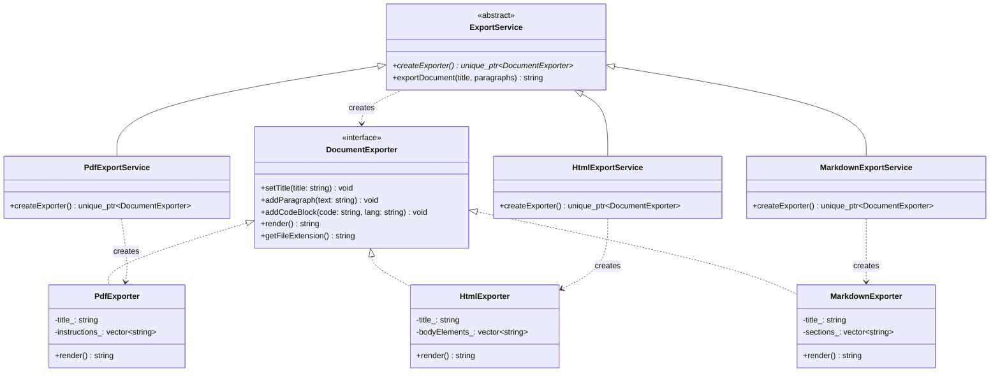
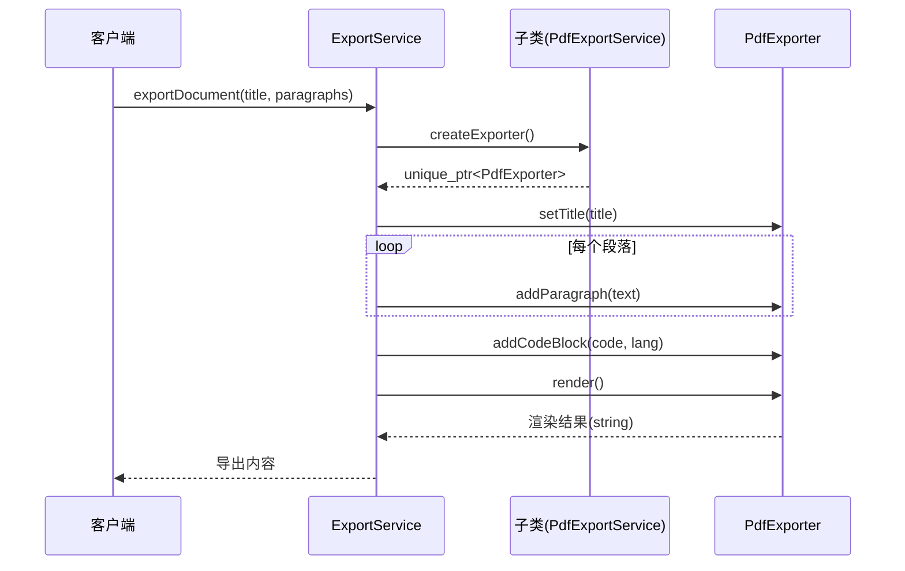

# 工厂方法模式（Factory Method）

## 模式分类
> 归属于 **"对象创建"** 分类。工厂方法模式将对象的实例化延迟到子类，由子类决定创建哪种具体产品。它解决的核心问题是：**如何在不指定具体类的情况下创建对象**，属于典型的创建型模式。

## 问题背景
> 假设你正在开发一个文档管理系统，需要支持将文档导出为 PDF、HTML、Markdown 等多种格式。最直接的做法是在导出逻辑中使用 `if-else` 或 `switch` 判断格式类型，然后 `new` 出对应的导出器。
>
> 问题在于：
> - 每次新增一种导出格式，都需要修改已有的判断逻辑（**违反开闭原则**）
> - 客户端代码与具体导出器类紧耦合
> - 导出流程（设置标题、添加内容、渲染输出）是通用的，不应因格式差异而重复编写

## 模式意图
> **GoF 定义**：定义一个用于创建对象的接口，让子类决定实例化哪一个类。工厂方法使一个类的实例化延迟到其子类。
>
> **通俗解释**：父类定义了"创建产品"的抽象方法（工厂方法），具体创建什么产品由子类说了算。父类只管调用这个方法拿到产品，然后按统一流程使用它。

## 类图

## 时序图

## 要点解析

1. **工厂方法是抽象的**：`ExportService::createExporter()` 是纯虚函数，父类不知道也不关心具体创建什么导出器。子类 `PdfExportService`、`HtmlExportService` 等各自实现这个方法。

2. **模板方法 + 工厂方法的组合**：`exportDocument()` 是一个模板方法，定义了通用的导出流程（设标题 -> 加内容 -> 渲染），其中用工厂方法获取导出器。这是两种模式的经典配合。

3. **返回 `std::unique_ptr`**：工厂方法返回智能指针而非裸指针，明确了所有权语义——调用者拥有该对象。这是现代 C++ 的最佳实践。

4. **开闭原则**：新增导出格式（如 LaTeX）只需添加 `LatexExporter` + `LatexExportService`，无需修改 `ExportService` 和已有的子类。

5. **产品接口的统一性**：所有导出器都实现 `DocumentExporter` 接口，确保客户端可以多态地使用任意导出器，不依赖具体实现细节。

## 示例代码说明

- **`FactoryMethod.h`**：声明了产品层次（`DocumentExporter` 及 PDF/HTML/Markdown 三个具体产品）和创建者层次（`ExportService` 及三个具体工厂）。
- **`FactoryMethod.cpp`**：
  - 每个具体导出器实现了各自的渲染逻辑：PDF 生成伪 PDF 指令流、HTML 生成完整的 HTML 文档、Markdown 生成标准 Markdown 格式。
  - `ExportService::exportDocument()` 展示了客户端如何通过工厂方法使用导出器，完全不知道具体类型。
  - `main()` 中依次演示三种格式的导出，并强调扩展性。

## 开源项目中的应用

| 项目 | 应用场景 |
|------|----------|
| **Qt Framework** | `QStyle::create()` 系列方法根据平台创建不同的样式对象；`QAbstractItemModel` 中子类决定创建什么类型的数据项 |
| **LLVM/Clang** | `TargetMachine` 的工厂方法为不同 CPU 架构创建不同的代码生成后端 |
| **VTK** | `vtkObjectFactory::CreateInstance()` 根据注册的工厂创建不同平台的渲染对象 |
| **Poco C++ Libraries** | `Poco::Net::HTTPRequestHandlerFactory` 子类决定为不同 URL 路径创建哪种请求处理器 |
| **C++ STL** | `std::allocator` 可视为工厂方法的简化形式，容器通过模板参数化的分配器创建元素 |

## 适用场景与注意事项

### 适用场景
- 不确定将来需要创建什么类型的对象，需要可扩展的创建机制
- 希望将产品的创建逻辑集中到专门的类中，而非分散在客户端代码里
- 框架/库需要允许用户自定义创建的对象类型

### 不适用场景
- 产品种类固定且不会变化，使用简单工厂（`if-else`）即可
- 创建逻辑极其简单（只有一种产品），引入工厂方法反而增加复杂度

### 与其他模式的对比
| 对比维度 | 工厂方法 | 抽象工厂 | 简单工厂 |
|----------|----------|----------|----------|
| 创建单个产品 vs 产品族 | 单个产品 | 一族相关产品 | 单个产品 |
| 扩展方式 | 继承（新增子类） | 继承（新增工厂子类） | 修改条件判断 |
| 开闭原则 | 满足 | 满足 | 不满足 |
| 复杂度 | 中等 | 较高 | 低 |
