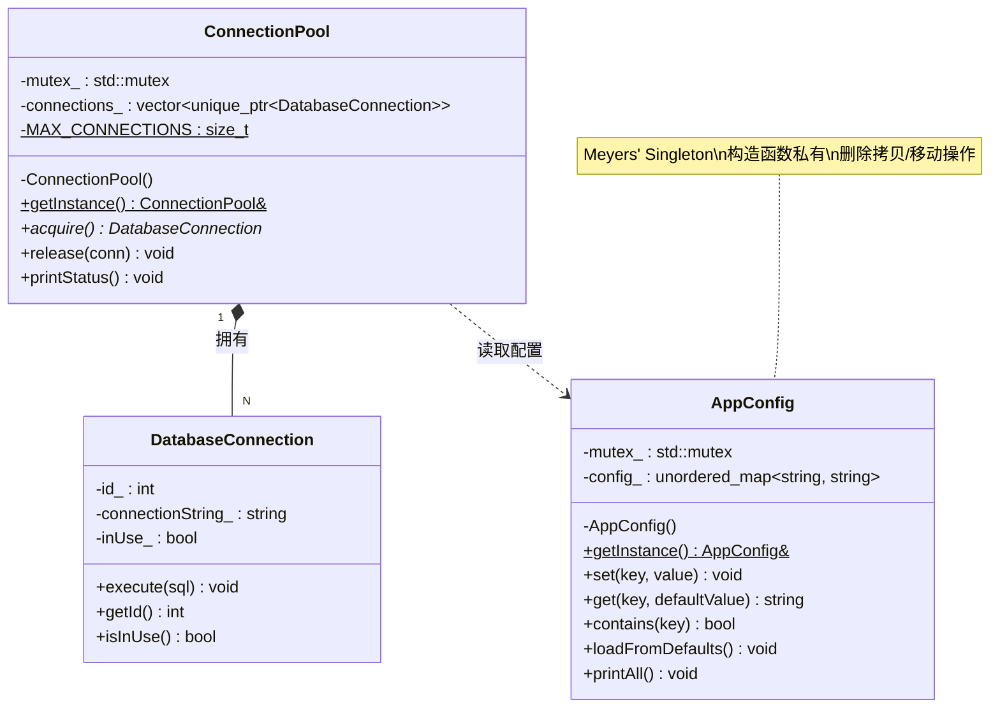
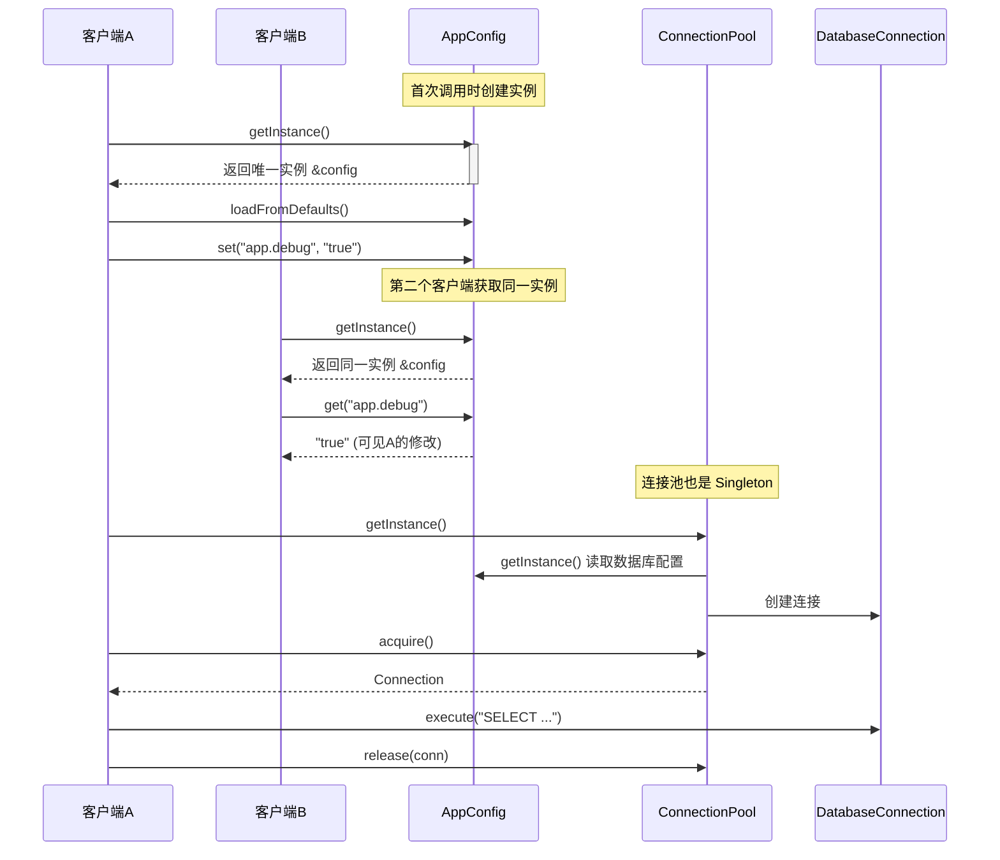

# 单例模式（Singleton）

## 模式分类

> **对象性能（Object Performance）**
>
> Singleton 属于"对象性能"分类，因为它的核心关注点是**控制对象的创建数量和创建成本**。通过确保全局只有一个实例，避免了重复创建开销较大的对象（如配置管理器、连接池、日志系统等），从而提升整体系统性能。

## 问题背景

> 在一个企业级应用中，我们需要一个**应用配置管理器**来统一管理所有配置项（数据库地址、日志级别、缓存策略等），同时需要一个**数据库连接池**来管理有限的数据库连接资源。
>
> 如果这些对象可以被随意创建：
> - 多个配置管理器实例会导致配置不一致，A 模块修改了配置但 B 模块看不到
> - 多个连接池实例会导致连接数失控，耗尽数据库资源
> - 每次创建都要重新加载配置或建立连接，浪费时间和内存
>
> 我们需要一种机制，**确保这些全局资源有且仅有一个实例**，并提供统一的访问入口。

## 模式意图

> **GoF 定义**：保证一个类仅有一个实例，并提供一个访问它的全局访问点。
>
> **通俗解释**：就像一个公司只有一个 CEO，无论哪个部门需要找 CEO，都是找同一个人。Singleton 模式就是用编程手段确保某个类只能被实例化一次，所有使用者拿到的都是同一个对象。

## 类图



## 时序图



## 要点解析

### 1. Meyers' Singleton 的线程安全性

```cpp
static AppConfig& getInstance() {
    static AppConfig instance;  // C++11 保证线程安全
    return instance;
}
```

C++11 标准（§6.7.4）明确规定：如果多个线程同时尝试初始化同一个静态局部变量，只有一个线程会执行初始化，其他线程会等待。这使得 Meyers' Singleton 在 C++11 及以后版本中天然是线程安全的，无需手动实现双检锁。

### 2. 禁止拷贝和移动

```cpp
AppConfig(const AppConfig&) = delete;
AppConfig& operator=(const AppConfig&) = delete;
AppConfig(AppConfig&&) = delete;
AppConfig& operator=(AppConfig&&) = delete;
```

仅仅把构造函数设为 `private` 还不够，必须显式删除拷贝构造函数、拷贝赋值运算符、移动构造函数和移动赋值运算符。否则，理论上可以通过 `auto copy = AppConfig::getInstance();` 绕过限制。

### 3. 数据安全仍需加锁

Meyers' Singleton 只保证**实例创建**的线程安全，不保证实例的**成员数据**在并发访问时的安全。因此需要用 `std::mutex` 保护共享数据：

```cpp
void set(const std::string& key, const std::string& value) {
    std::lock_guard<std::mutex> lock(mutex_);  // 必须加锁
    config_[key] = value;
}
```

### 4. 返回引用而非指针

`getInstance()` 返回引用 `AppConfig&` 而非指针 `AppConfig*`，有两个好处：
- 调用者不会误以为需要 `delete` 释放
- 从语义上明确表示"总是存在"的，不会为 `nullptr`

### 5. Singleton 之间的依赖

连接池在初始化时需要读取配置管理器中的数据库地址，这是两个 Singleton 之间的依赖关系。C++ 中静态变量的销毁顺序与创建顺序相反，因此需要注意不要在析构函数中访问可能已被销毁的其他 Singleton。

## 示例代码说明

本目录下的示例展示了两个互相协作的 Singleton：

- **`AppConfig`**：应用配置管理器，使用 `std::unordered_map` 存储键值对配置，提供线程安全的读写接口。展示了 Meyers' Singleton 的标准写法。

- **`ConnectionPool`**：数据库连接池，预创建 5 个 `DatabaseConnection` 对象，使用 `std::unique_ptr` 管理生命周期。连接池从 `AppConfig` 读取数据库连接信息，展示了 Singleton 之间的协作。

- **`main()` 函数**：
  1. 演示配置管理器的基本使用和单例验证（地址对比）
  2. 多线程并发获取单例，验证线程安全性
  3. 连接池的获取/归还操作
  4. 多线程并发使用连接池

## 开源项目中的应用

| 项目 | 使用场景 | 说明 |
|------|----------|------|
| **Qt** | `QApplication` | 一个 Qt 程序只能有一个 `QApplication` 实例，通过 `qApp` 宏全局访问 |
| **Boost** | `boost::serialization::singleton` | 提供了通用的 Singleton 模板实现 |
| **LLVM** | `ManagedStatic` | 延迟初始化的 Singleton，支持在程序结束时显式销毁，避免静态析构顺序问题 |
| **spdlog** | 默认 logger | 日志库提供全局默认 logger 单例 |
| **Folly** (Facebook) | `folly::Singleton` | 提供了带依赖管理、泄漏检测的企业级 Singleton 实现 |
| **glog** (Google) | 日志初始化 | `google::InitGoogleLogging()` 内部维护全局唯一的日志配置 |

## 适用场景与注意事项

### 适用场景
- **全局配置管理**：应用配置只需要一份，所有模块共享
- **资源池管理**：数据库连接池、线程池等需要统一管理的资源
- **日志系统**：全局日志记录器
- **硬件访问**：打印机管理器、设备驱动管理等

### 注意事项
- **不要滥用 Singleton**：它本质是一个"文明的全局变量"，过度使用会导致模块间紧耦合
- **测试困难**：Singleton 使得单元测试中难以替换依赖（mock），建议搭配依赖注入使用
- **生命周期管理**：C++ 中静态变量的销毁顺序不完全可控，跨 Singleton 的依赖可能导致崩溃
- **多线程注意数据安全**：Meyers' Singleton 只保证创建安全，成员访问仍需加锁

### 与其他模式的对比

| 对比维度 | Singleton | 静态类（Static Class） | 依赖注入 |
|----------|-----------|----------------------|----------|
| 实例化控制 | 有（只创建一个） | 无（无实例） | 由容器管理 |
| 延迟初始化 | 支持 | 不适用 | 支持 |
| 可测试性 | 差 | 差 | 好 |
| 多态支持 | 支持（可有虚函数） | 不支持 | 支持 |
| 推荐度 | 谨慎使用 | 适合纯工具函数 | 优先考虑 |
