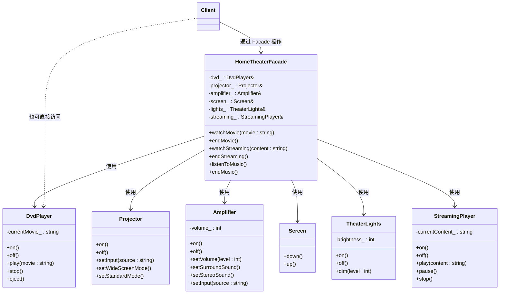
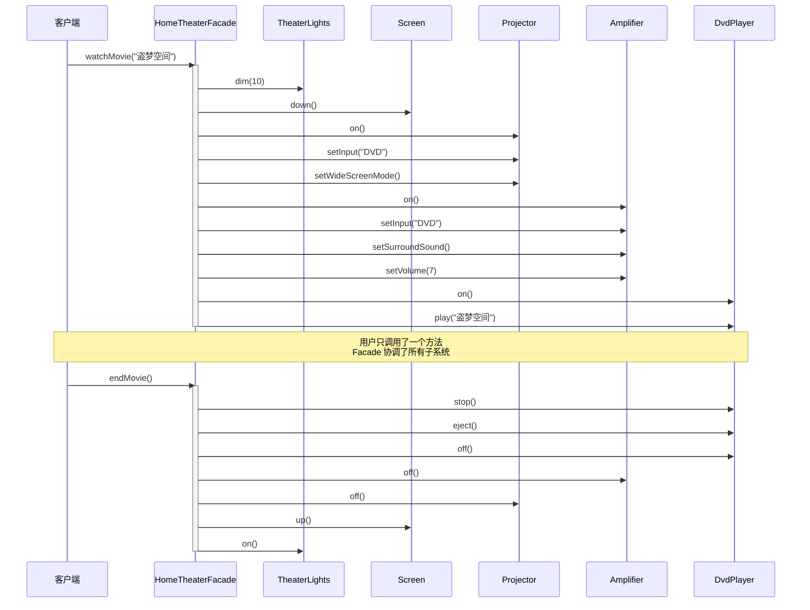

# 外观模式（Facade Pattern）

## 模式分类

> 归属于 **"接口隔离"** 分类。Facade 模式的核心目标是在客户端与复杂子系统之间建立一道"隔离层"，客户端不需要了解子系统内部的复杂交互，只需通过 Facade 提供的简洁接口即可完成操作。它通过接口简化实现了隔离，降低了客户端对子系统的直接依赖。

## 问题背景

> 假设你正在开发一套家庭影院控制系统。系统包含 DVD 播放器、投影仪、功放、电动幕布、灯光、流媒体播放器等多个设备。要完成"看电影"这个简单操作，用户需要：
>
> 1. 调暗灯光 → 2. 放下幕布 → 3. 打开投影仪 → 4. 设置投影仪输入源 → 5. 设置宽屏模式 → 6. 打开功放 → 7. 设置功放输入源 → 8. 设置环绕声 → 9. 调节音量 → 10. 打开 DVD → 11. 播放电影
>
> 关一次电影又需要反向操作。每次看电影都要执行十几步操作，而且操作顺序还不能错——这对用户来说太复杂了。

## 模式意图

> **GoF 定义**：为子系统中的一组接口提供一个统一的高层接口。Facade 定义了一个更高层的接口，使得子系统更容易使用。
>
> **通俗解释**：Facade（外观）就像一个"万能遥控器"，把看电影需要的十几步操作封装成一个"一键观影"按钮。用户不需要知道背后有多少设备在协同工作，也不需要关心操作顺序，只需按一个按钮。

## 类图



## 时序图



## 要点解析

### 1. Facade 不"拥有"子系统
Facade 持有子系统的引用（而非所有权），这意味着子系统的生命周期独立于 Facade。客户端既可以通过 Facade 简化操作，也可以在需要时绕过 Facade 直接操作子系统。

### 2. Facade 不增加新功能
Facade 本身不包含业务逻辑，它只是把已有的子系统操作按正确顺序编排在一起。它是一个"便利层"，不是"功能层"。

### 3. 可以有多个 Facade
一个子系统可以有多个 Facade，针对不同的使用场景提供不同的简化接口。例如可以有 `SimpleTheaterFacade`（只提供看电影）和 `AdvancedTheaterFacade`（提供更多定制选项）。

### 4. 符合迪米特法则（最少知识原则）
客户端只需要知道 Facade，不需要知道 DVD、投影仪等子系统的存在和操作细节，大大降低了系统的耦合度。

### 5. 与"上帝对象"的区别
Facade 只做子系统操作的编排，不承担子系统的业务逻辑。如果 Facade 开始承担过多职责（如直接管理设备状态），它就退化为反模式"上帝对象"了。

## 示例代码说明

本目录下的代码实现了一个家庭影院 Facade：

- **`Facade.h`**：声明了 6 个子系统类（`DvdPlayer`、`Projector`、`Amplifier`、`Screen`、`TheaterLights`、`StreamingPlayer`）和 1 个 Facade 类（`HomeTheaterFacade`）
- **`Facade.cpp`**：实现了所有子系统方法和 Facade 的编排逻辑

关键代码结构：
```cpp
// Facade 持有子系统引用，不拥有其生命周期
class HomeTheaterFacade {
    DvdPlayer& dvd_;
    Projector& projector_;
    // ...
public:
    void watchMovie(const std::string& movie);  // 编排 10+ 步操作
    void endMovie();                             // 编排反向操作
};
```

`main()` 函数演示了 4 个场景：
1. 通过 Facade 一键观影（展示核心用法）
2. 通过 Facade 一键看流媒体（展示不同编排）
3. 通过 Facade 一键听音乐（展示部分子系统参与）
4. 绕过 Facade 直接操作子系统（证明 Facade 不强制使用）

## 开源项目中的应用

| 项目 | 应用场景 |
|------|----------|
| **Qt** | `QFile` 是对底层文件 I/O 操作（open/read/write/seek/close）的 Facade；`QNetworkAccessManager` 是对 HTTP/HTTPS 协议栈的 Facade |
| **Boost** | `boost::filesystem` 为操作系统文件 API 提供统一 Facade |
| **LLVM** | `llvm::LLVMContext` 作为 LLVM 编译基础设施的 Facade，简化了 Module/Type/Constant 等子系统的使用 |
| **OpenCV** | `cv::VideoCapture` 为不同视频捕获后端（V4L2、DirectShow、FFmpeg）提供统一 Facade |
| **SDL** | `SDL_Init()` / `SDL_Quit()` 是对视频、音频、事件、定时器等子系统初始化的 Facade |

## 适用场景与注意事项

### 适用场景
- 需要为复杂子系统提供简单入口时
- 客户端与多个子系统之间存在大量耦合时
- 需要对子系统进行分层设计时（每一层用 Facade 作为入口点）

### 不适用场景
- 子系统足够简单，不需要额外的封装层
- 客户端需要高度定制化的子系统操作（Facade 的简化反而成为限制）
- 不要用 Facade 来"隐藏"设计不良的子系统，应该优先改善子系统本身

### 与其他模式对比

| 对比维度 | Facade | Adapter | Mediator |
|---------|--------|---------|----------|
| **目的** | 简化接口 | 转换接口 | 协调交互 |
| **方向** | 单向（客户端→子系统） | 双向转换 | 多向协调 |
| **新增接口** | 定义新的简化接口 | 适配已有接口 | 定义交互协议 |
| **子系统感知** | 子系统不知道 Facade 存在 | 被适配者不知道 Adapter 存在 | 同事对象知道 Mediator 存在 |
