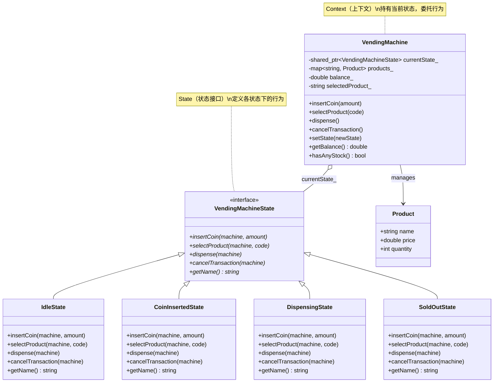
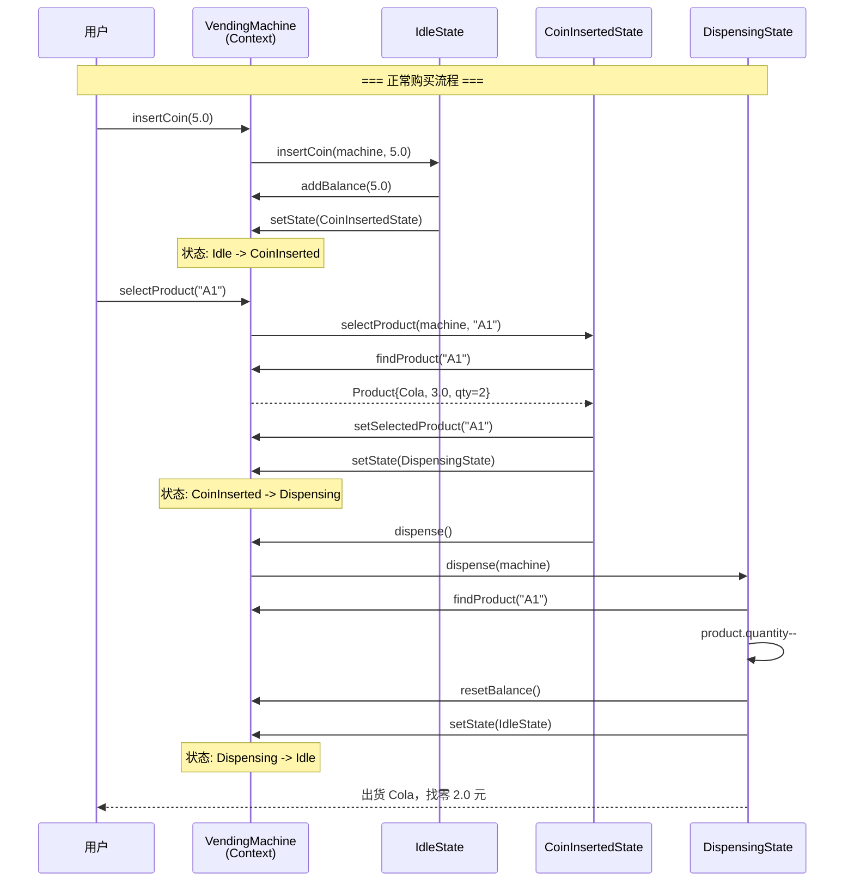

# 状态模式（State Pattern）

## 模式分类

> 状态模式属于 **"状态变化"** 分类。该分类关注对象在运行时内部状态的管理与变化。状态模式的核心在于：当对象的行为随状态改变而改变时，如何避免大量的条件分支语句（if-else / switch-case），并让状态转换逻辑清晰、可维护？状态模式通过将每种状态封装为独立对象来解决这一问题。

## 问题背景

> 自动售货机在不同状态下对相同操作有截然不同的响应：
>
> - **空闲状态**：可以投币，不能选商品、不能出货
> - **已投币状态**：可以继续投币、选商品、取消退款
> - **出货状态**：不能投币、不能选商品、不能取消
> - **售罄状态**：拒绝一切操作
>
> 如果用条件��支实��，每个方法都要写 `if (state == IDLE) ... else if (state == COIN_INSERTED) ...`，导致：
> - 代码高度重复，逻辑散落在各处
> - 新增状态时需要修改所有方法（违反开闭原则）
> - 状态转换条件难以追踪，容易出错

## 模式意图

> **GoF 原书定义**：允许一个对象在其内部状态改变时改变它的行为。对象看起来似乎修改了它的类。
>
> **通俗解释**：状态模式就像一台多功能打印机上的模式切换按钮。当你切换到"打印模式"时，按下执行键会打印文档；切换到"扫描模式"时，同样的执行键会启动扫描。打印机本身没变，但它的行为因为内部模式（状态）的不同而完全改变。每种模式是一个独立的状态对象，打印机把操作委托给当前模式去处理。

## 类图



## 时序图



## 要点解析

### 1. 消除条件分支

状态模式最大的价值在于将散落在各方法中的状态判断逻辑，集中封装到独立的状态类中。**无需任何 if-else 或 switch-case**，每种状态自己知道该如何响应每种操作。

```cpp
// 反模式：条件分支实现
void insertCoin(double amount) {
    if (state_ == IDLE) { ... }
    else if (state_ == COIN_INSERTED) { ... }
    else if (state_ == DISPENSING) { ... }
    else if (state_ == SOLD_OUT) { ... }
}

// 状态模式：委托给当前状态对象
void insertCoin(double amount) {
    currentState_->insertCoin(*this, amount);
}
```

### 2. 状态对象由谁决定下一个状态

本实现中，**状态转换由各 ConcreteState 自己决定**（如 `IdleState::insertCoin` 中调用 `machine.setState(machine.getCoinInsertedState())`）。这是最常见的做法，因为每个状态最清楚自己在什么条件下应该转到哪个状态。

另一种做法是由 Context 集中管理转换逻辑——适用于状态转换规则需要全局可见的场景。

### 3. 状态对象的共享与复用

本实现在 `VendingMachine` 构造时预创建了所有状态对象（`idleState_`, `coinInsertedState_` 等），各状态是无实例���据的纯行为对象，因此可以安全地用 `shared_ptr` 共享复用，避免每次状态转换都 `new` 一个对象。

### 4. Context 暴露数据接口

状态对象需要读写 Context 的数据（余额、商品库存等），因此 `VendingMachine` 提供了 `addBalance()`, `getBalance()`, `findProduct()` 等接口。这是状态模式的常见权衡——状态对象与 Context 之间存在必要的耦合。

### 5. 状态转换的完整性

每个状态类必须实现所有操作方法，即使某些操作在当前状态下无意义（如 `SoldOutState::insertCoin` 只打印拒绝消息）。这保证了任何操作在任何状态下都有明确定义的行为，不会出现未处理的情况。

## 示例代码说明

本示例以自动售货机为场景，包含以下角色：

- **`VendingMachineState`（State 接口）**：定义 `insertCoin`, `selectProduct`, `dispense`, `cancelTransaction` 四个操作。
- **`IdleState` / `CoinInsertedState` / `DispensingState` / `SoldOutState`**：四个具体状态，各自实现在该状态下对四种操作的响应。
- **`VendingMachine`（Context）**：持有当前状态对象，将所有操作委托给它。提供 `setState()` 供状态对象触发转换，以及余额/库存等数据接口。

`main()` 函数演示了 6 个场景：
1. 正常购买流程（投币 -> 选商品 -> 出货 -> 找零）
2. 余额不足（追加投币后再选购）
3. 取消交易（退款回到空闲）
4. 空闲状态下的无效操作
5. 连续购买直到售罄（状态自动转为 SoldOut）
6. 售罄状态下的操作（全部被拒绝）

## 开源项目中的应用

| 项目 | 应用场景 |
|------|----------|
| **Boost.Statechart / Boost.MSM** | 完整的有限状态机框架，直接支持状态模式的实现，提供层次状态、正交区域等高级特性 |
| **Qt Framework** | `QStateMachine` 和 `QState` 实现了完整的状态机框架，广泛用于 UI 交互逻辑和动画状态管理 |
| **LLVM** | 编译器后端的指令调度器使用状态机管理调度阶段的转换 |
| **TCP 协议栈** | TCP 连接的状态管理（LISTEN, SYN_SENT, ESTABLISHED, FIN_WAIT 等）是状态模式的经典应用 |
| **游戏引擎（Unreal/Unity）** | 角色 AI 的行为状态机（Idle, Patrol, Chase, Attack）广泛使用状态模式 |
| **Rust `state_machine` crate** | 提供编译期状态机宏，在类型系统层面保证状态转换合法性 |

## 适用场景与注意事项

### 适用场景
- **对象行为依赖于状态**：同一操作在不同状态下有不同的行为逻辑
- **大量条件分支**：如果发现方法中充斥着基于状态枚举的 if-else/switch-case，考虑使用状态模式
- **状态转换有明确规则**：如协议状态机、工作流引擎、游戏 AI
- **状态数量有限且已知**：状态模式适合有限状态机（FSM）场景

### 注意事项
- **状态类数量膨胀**：每个状态对应一个类，状态过多时会产生大量小类。可考虑使用状态表（State Table）替代
- **状态间共享数据**：如果状态对象需要大量 Context 数据，接口会变得臃肿。权衡是让 Context 传递自身引用
- **状态转换不宜过于分散**：如果转换规则非常复杂（依赖多个条件），集中管理可能比分散在各状态类中更清晰

### 与其他模式的对比
| 模式 | 区别 |
|------|------|
| **Strategy** | Strategy 让客户端选择算法，对象主动选择策略；State 让对象根据内部状态自动改变行为，转换是自动的 |
| **Command** | Command 封装的是"请求"，State 封装的是"状态下的行为"。Command 可与 State 配合使用 |
| **Memento** | Memento 保存/恢复状态的值；State 改变的是状态关联的行为 |
