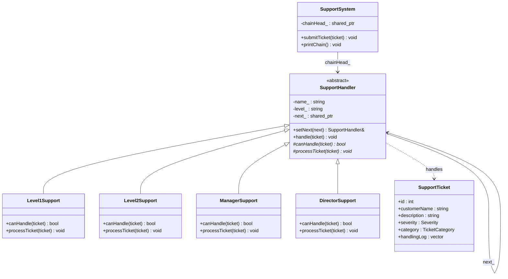
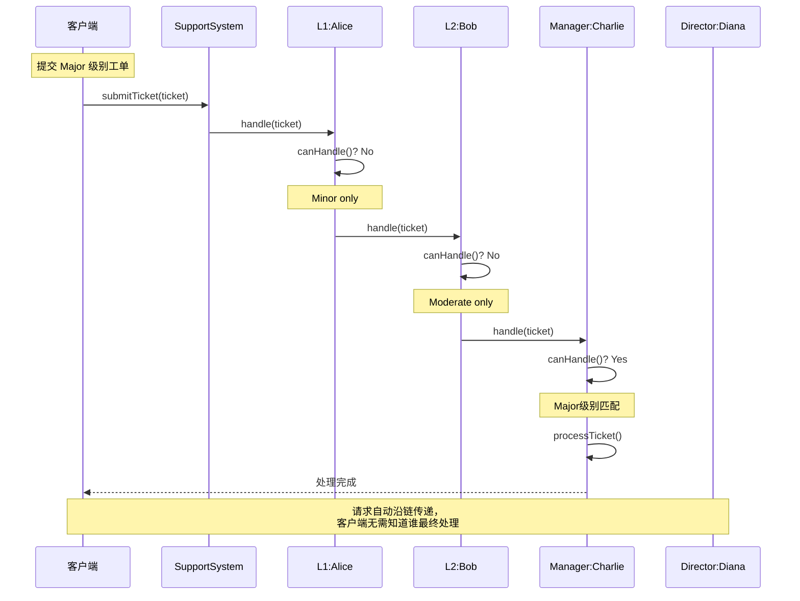

# 责任链模式（Chain of Responsibility Pattern）

## 模式分类
> 归属于 **"数据结构"** 分类。责任链模式的核心数据结构是**单向链表**——每个处理者持有指向下一个处理者的指针，请求沿着链表依次传递，直到被某个节点处理。链表的构建、遍历和节点间的连接关系是该模式的结构基础。

## 问题背景
> 在技术支持系统中，客户提交的工单严重程度各异：简单的密码重置、中等难度的软件配置、重大的数据恢复、紧急的生产宕机。如果所有工单都直接提交给技术总监，高层将被大量简单问题淹没；如果用大量的 `if/else` 判断严重程度并分配给对应级别的人员，新增支持级别时需要修改核心分发逻辑。
>
> 我们需要一种机制：**每个处理者只关心自己能否处理当前请求**，处理不了就自动传递给下一级，整个过程对客户端透明。

## 模式意图
> **GoF 定义：** 使多个对象都有机会处理请求，从而避免请求的发送者和接收者之间的耦合关系。将这些对象连成一条链，并沿着这条链传递该请求，直到有一个对象处理它为止。
>
> **通俗解释：** 就像公司请假审批流程——请假1天组长直接批，3天需要部门经理批，7天以上需要总经理批。你只需要把请假条交给直接上级，它会自动沿着审批链往上走，直到有权限的人审批为止。你不需要知道最终是谁批的。

## 类图

## 时序图

## 要点解析

### 1. 链的构建与解耦
`setNext()` 方法将处理者串联成链，返回下一个处理者的引用以支持链式调用。链的构建逻辑集中在 `SupportSystem` 中，各处理者之间不需要知道彼此的存在——它们只知道"下一个"是谁。

### 2. 非虚接口（NVI）模式
`handle()` 方法是非虚的公共方法，定义了固定的处理流程："先判断能否处理 → 能处理则执行 → 不能处理则转发"。子类只需实现 `canHandle()` 和 `processTicket()` 两个受保护的虚函数，不能改变转发逻辑。

### 3. 兜底处理者
`DirectorSupport` 的 `canHandle()` 始终返回 `true`，作为链的最后一环兜底处理所有请求。这是一种常见的设计策略，确保没有请求会"掉链子"。如果不设兜底，则 `handle()` 中需要处理链尾无人处理的情况。

### 4. 处理日志的审计追踪
每个工单携带 `handlingLog` 记录完整的处理路径。请求经过的每一个节点都会留下记录，这对于审计和排查问题非常有价值——你可以清楚地看到工单是经过哪些级别的评估后最终被谁解决的。

### 5. 请求的不可预知性
客户端提交工单时不需要指定由谁处理，也不需要知道有几个处理级别。这种设计使得修改链结构（增加/删除/调整级别顺序）不影响客户端代码。

## 示例代码说明

### ChainOfResponsibility.h
定义了完整的责任链体系：
- `SupportTicket`：工单实体，包含严重程度、类别和处理日志
- `SupportHandler`：抽象处理者，定义链的连接和转发逻辑
- 四个具体处理者：`Level1Support`、`Level2Support`、`ManagerSupport`、`DirectorSupport`
- `SupportSystem`：门面类，负责构建链和提交工单

### ChainOfResponsibility.cpp
演示了六种不同严重程度的工单：
1. **Minor/Account** —— L1 直接处理密码重置
2. **Moderate/Software** —— L1 跳过，L2 处理配置问题
3. **Major/DataRecovery** —— 经过 L1、L2，Manager 处理数据恢复
4. **Critical/Network** —— 经过所有级别，Director 处理生产宕机
5. **Critical/Security** —— Director 处理安全事件
6. **Minor/Software** —— L1 处理简单软件问题

最后输出汇总表格，展示每个工单的处理路径和步骤数。

## 开源项目中的应用

| 项目 | 应用场景 |
|------|----------|
| **Java Servlet** | `Filter` 链（`FilterChain.doFilter()`），请求依次经过多个过滤器 |
| **Spring Security** | `SecurityFilterChain`，认证和授权请求沿过滤器链传播 |
| **Netty** | `ChannelPipeline` 中的 `ChannelHandler` 链，网络事件沿管道传递 |
| **ATL/WTL (Windows)** | 消息映射链，Windows 消息沿控件层次传递 |
| **Boost.Asio** | 异步操作完成处理器的链式组合 |
| **Qt** | 事件处理系统：事件从子控件向父控件冒泡，未处理的事件传递给父对象 |

## 适用场景与注意事项

### 适用场景
- 多个对象可以处理同一请求，但具体由哪个对象处理在运行时确定
- 需要在不明确指定接收者的情况下，向多个对象中的某一个提交请求
- 可处理请求的对象集合需要**动态指定**（运行时组装链）
- 处理逻辑有**层级关系**，如审批流、错误处理、中间件管道

### 不适用场景
- 每个请求都**必须被处理**且你无法保证链中有兜底节点
- 链过长导致**性能问题**——每个请求都要遍历大量节点
- 需要明确知道**谁处理了请求**——责任链的匿名性可能导致调试困难（但可通过日志补偿）

### 与其他模式的对比
| 对比模式 | 关系 |
|----------|------|
| **命令模式（Command）** | 命令模式封装请求为对象，责任链决定由谁处理该请求。两者可以组合：命令对象沿责任链传递 |
| **装饰器模式（Decorator）** | 结构类似（都是链式封装），但装饰器每个节点都执行增强操作，责任链只有一个节点最终处理 |
| **中介者模式（Mediator）** | 中介者是集中式调度，责任链是分布式传递。中介者知道所有参与者，责任链中每个节点只知道下一个 |
| **观察者模式（Observer）** | 观察者是一对多广播，责任链是一对一传递直到被处理 |
