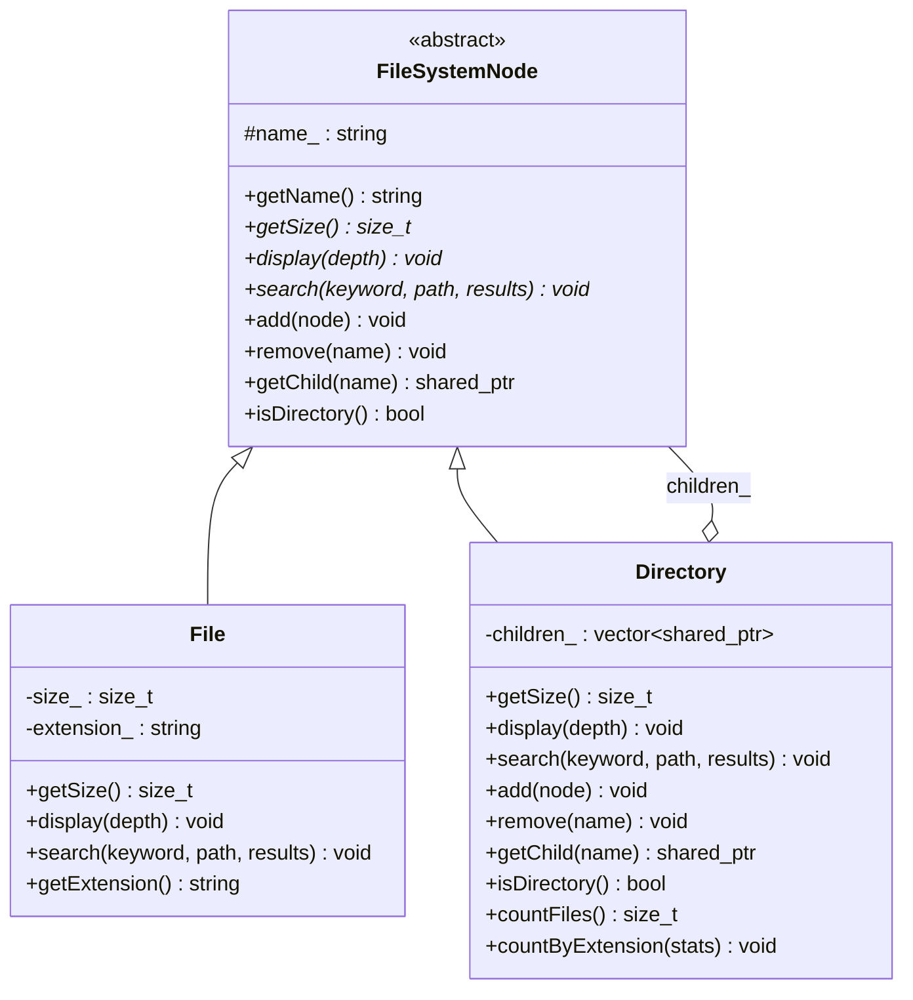
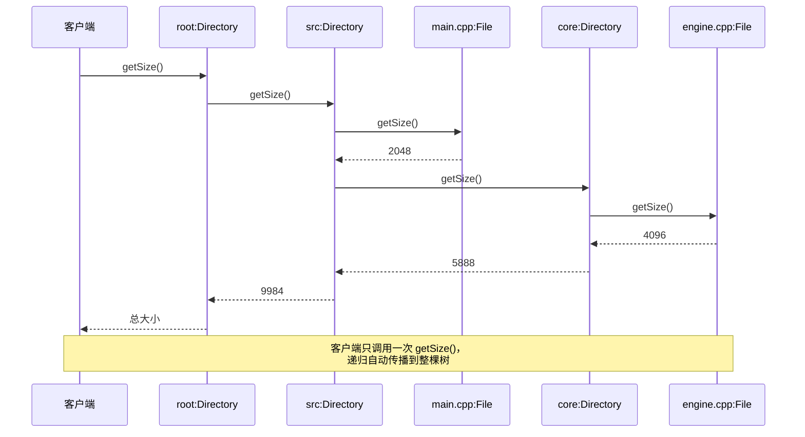

# 组合模式（Composite Pattern）

## 模式分类
> 归属于 **"数据结构"** 分类。组合模式的核心在于构建**树形递归数据结构**，让客户端可以统一地处理单个对象和对象的组合。树形结构本身就是一种经典的数据结构，而组合模式提供了面向对象的方式来构建和操作这种结构。

## 问题背景
> 在文件系统管理中，我们需要处理两类不同的实体：**文件**和**目录**。文件是叶子节点，没有子元素；目录是容器节点，可以包含文件或其他子目录。如果为文件和目录分别编写处理逻辑，代码中将充斥大量的类型判断（`if/else`、`dynamic_cast`），新增节点类型时需要修改所有已有的处理代码。我们希望客户端能够**无差别地**对待文件和目录，用同一套接口完成大小计算、搜索、显示等操作。

## 模式意图
> **GoF 定义：** 将对象组合成树形结构以表示"部分-整体"的层次结构。组合模式使得用户对单个对象和组合对象的使用具有一致性。
>
> **通俗解释：** 就像文件管理器中的文件夹——你可以把文件夹当作一个"大文件"来操作（复制、移动、计算大小），文件夹内部会自动把操作传递给里面的每一个文件和子文件夹。客户端代码不需要关心操作的目标是单个文件还是整个目录树。

## 类图

## 时序图

## 要点解析

### 1. 透明式组合 vs 安全式组合
本实现采用**透明式组合**：`add()`、`remove()`、`getChild()` 定义在基类 `FileSystemNode` 中，默认实现抛出异常。这样客户端可以完全通过基类指针操作所有节点，无需知道具体类型。代价是对叶子节点调用管理操作会在运行时报错（而非编译时）。

### 2. 递归结构与统一接口
`Directory` 持有 `vector<shared_ptr<FileSystemNode>>` 作为子节点集合。`getSize()` 的实现中，目录递归累加所有子节点的大小——无论子节点是文件还是子目录，调用方式完全一致。这是组合模式最核心的价值。

### 3. 共享所有权语义
使用 `std::shared_ptr` 管理子节点，因为在搜索结果返回、外部引用等场景下，节点可能被多处持有。如果确定节点只属于一个父目录，也可以使用 `std::unique_ptr` 以获得更严格的所有权语义。

### 4. 递归操作的终止条件
每个递归操作（`getSize`、`display`、`search`）都有明确的终止条件：`File`（叶子节点）直接返回自身的值，不再递归。这是树形递归的基本范式。

## 示例代码说明

### Composite.h
定义了三层类结构：
- `FileSystemNode`：抽象基类，声明统一接口
- `File`：叶子节点，持有文件大小和扩展名
- `Directory`：容器节点，持有子节点集合

### Composite.cpp
演示了组合模式的六个典型用法：
1. **构建树结构**：创建包含 `src/`、`docs/`、`build/` 的项目目录树
2. **统一计算大小**：对根目录调用 `getSize()`，自动递归累加
3. **搜索功能**：按关键字在整棵树中搜索文件
4. **统计分析**：统计文件总数和按扩展名分类统计
5. **动态修改**：运行时添加/删除子目录
6. **异常处理**：演示对叶子节点调用 `add()` 时的错误处理

## 开源项目中的应用

| 项目 | 应用场景 |
|------|----------|
| **Qt** | `QObject` 的父子树结构，`QWidget` 嵌套形成 UI 组件树 |
| **Boost.Filesystem** | `directory_iterator` 遍历目录树，文件和目录共享 `path` 接口 |
| **LLVM** | `Value` 层次结构中，`Instruction` 可包含操作数，`BasicBlock` 包含指令序列 |
| **Unreal Engine** | `USceneComponent` 树形结构，父组件的 Transform 自动传播到子组件 |
| **React/Vue** | Virtual DOM 树就是典型的组合模式——每个节点可以是叶子元素或包含子节点的容器 |

## 适用场景与注意事项

### 适用场景
- 需要表示**部分-整体**层次结构（文件系统、组织架构、UI组件树、XML/JSON解析树）
- 希望客户端**统一对待**叶子对象和容器对象
- 需要在树结构上进行**递归操作**（遍历、搜索、聚合计算）

### 不适用场景
- 叶子和容器的接口差异太大，强行统一会导致大量空实现或异常
- 结构不是树形的（有环引用或多父节点）——此时应考虑图结构
- 性能敏感且树很深——递归调用栈可能溢出，需要改用迭代方式

### 与其他模式的对比
| 对比模式 | 关系 |
|----------|------|
| **装饰器（Decorator）** | 都使用递归组合，但装饰器是线性链，组合模式是树形结构 |
| **迭代器（Iterator）** | 组合模式定义结构，迭代器提供遍历方式，两者常配合使用 |
| **访问者（Visitor）** | 当树节点操作频繁变化时，可用访问者模式将操作外置，避免修改节点类 |
