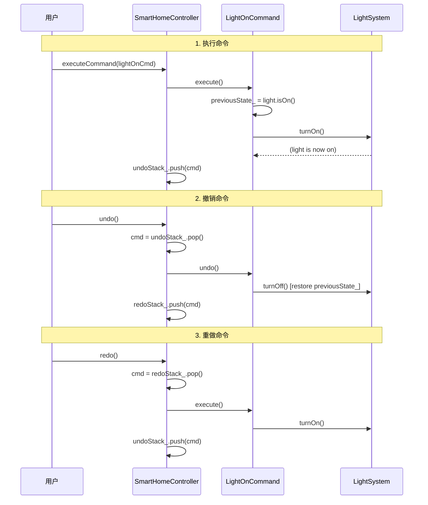

# 命令模式（Command Pattern）

## 模式分类

> 命令模式归属于**"行为变化"**分类。当系统需要将"操作请求"与"操作执行"解耦时，命令模式通过将请求封装为独立对象，使得请求的发送者和接收者之间不直接依赖。这种行为层面的变化——即操作的参数化、延迟执行、排队、撤销/重做——正是"行为变化"类模式所关注的核心问题。

## 问题背景

> 在智能家居系统中，用户通过一个中央控制器操作多种设备（灯光、恒温器、音乐系统）。面临的挑战包括：
>
> 1. **设备种类多样**：每种设备的操作接口各不相同，控制器如何统一管理？
> 2. **撤销/重做需求**：用户误操作后需要恢复到之前的状态
> 3. **场景模式**：需要将多个操作组合为一个"一键执行"的宏命令（如"电影模式"、"晚安模式"）
> 4. **命令历史**：需要记录所有操作用于审计和回放
>
> 如果控制器直接调用每个设备的方法，则控制器与所有设备紧耦合，撤销逻辑会散布在各处，宏命令的实现更是无从下手。

## 模式意图

> **GoF 定义**：将一个请求封装为一个对象，从而使你可用不同的请求对客户进行参数化；对请求排队或记录请求日志，以及支持可撤销的操作。
>
> **通俗解释**：把"做某件事"这个动作包装成一个小盒子（命令对象），盒子里记住了"要做什么"和"怎么撤销"。控制器只需要管理这些盒子——执行、撤销、重做、排队——而不需要知道盒子里具体是什么操作。

## 类图

```mermaid
classDiagram
    class Command {
        <<interface>>
        +execute()*
        +undo()*
        +description()* string
    }

    class LightOnCommand {
        -light_ : shared_ptr~LightSystem~
        -previousState_ : bool
        +execute()
        +undo()
        +description() string
    }

    class LightOffCommand {
        -light_ : shared_ptr~LightSystem~
        -previousState_ : bool
        +execute()
        +undo()
    }

    class LightBrightnessCommand {
        -light_ : shared_ptr~LightSystem~
        -targetBrightness_ : int
        -previousBrightness_ : int
        +execute()
        +undo()
    }

    class ThermostatSetTempCommand {
        -thermostat_ : shared_ptr~Thermostat~
        -targetTemp_ : double
        -previousTemp_ : double
        +execute()
        +undo()
    }

    class ThermostatModeCommand {
        -thermostat_ : shared_ptr~Thermostat~
        -targetMode_ : string
        -previousMode_ : string
        +execute()
        +undo()
    }

    class MusicPlayCommand {
        -music_ : shared_ptr~MusicSystem~
        -playlist_ : string
        -wasPlaying_ : bool
        +execute()
        +undo()
    }

    class MusicStopCommand {
        -music_ : shared_ptr~MusicSystem~
        -wasPlaying_ : bool
        +execute()
        +undo()
    }

    class MusicVolumeCommand {
        -music_ : shared_ptr~MusicSystem~
        -targetVolume_ : int
        -previousVolume_ : int
        +execute()
        +undo()
    }

    class MacroCommand {
        -name_ : string
        -commands_ : vector~unique_ptr~Command~~
        +addCommand(cmd)
        +execute()
        +undo()
    }

    class SmartHomeController {
        -undoStack_ : stack~unique_ptr~Command~~
        -redoStack_ : stack~unique_ptr~Command~~
        -history_ : vector~string~
        +executeCommand(cmd)
        +undo()
        +redo()
        +showHistory()
    }

    class LightSystem {
        -room_ : string
        -on_ : bool
        -brightness_ : int
        +turnOn()
        +turnOff()
        +setBrightness(level)
    }

    class Thermostat {
        -zone_ : string
        -temperature_ : double
        -mode_ : string
        +setTemperature(temp)
        +setMode(mode)
    }

    class MusicSystem {
        -playing_ : bool
        -volume_ : int
        -currentPlaylist_ : string
        +play(playlist)
        +stop()
        +setVolume(volume)
    }

    Command <|.. LightOnCommand
    Command <|.. LightOffCommand
    Command <|.. LightBrightnessCommand
    Command <|.. ThermostatSetTempCommand
    Command <|.. ThermostatModeCommand
    Command <|.. MusicPlayCommand
    Command <|.. MusicStopCommand
    Command <|.. MusicVolumeCommand
    Command <|.. MacroCommand

    MacroCommand o-- Command : contains

    LightOnCommand --> LightSystem
    LightOffCommand --> LightSystem
    LightBrightnessCommand --> LightSystem
    ThermostatSetTempCommand --> Thermostat
    ThermostatModeCommand --> Thermostat
    MusicPlayCommand --> MusicSystem
    MusicStopCommand --> MusicSystem
    MusicVolumeCommand --> MusicSystem

    SmartHomeController --> Command : manages
```

## 时序图

## 要点解析

1. **命令对象保存状态快照**：每个具体命令在 `execute()` 前保存接收者的当前状态（如 `previousBrightness_`），`undo()` 时用该快照恢复。这是实现可靠撤销的关键。

2. **接收者用 `shared_ptr` 持有**：多个命令可能操作同一设备（如客厅灯光），使用 `shared_ptr` 确保设备生命周期由所有引用它的命令共同管理。

3. **调用者与接收者解耦**：`SmartHomeController` 只与 `Command` 接口交互，完全不知道 `LightSystem`、`Thermostat` 等具体设备的存在。新增设备类型只需添加新的命令类。

4. **宏命令 = 组合模式 + 命令模式**：`MacroCommand` 持有一组子命令，`execute()` 顺序执行，`undo()` 逆序撤销。它本身也是 `Command`，可以被嵌套到更高层的宏命令中。

5. **重做栈的清空策略**：执行新命令时清空 `redoStack_`，因为新操作创建了新的历史分支，旧的"未来"已不再有效。这与大多数编辑器的行为一致。

6. **命令历史用于审计**：`history_` 以文本形式记录所有操作（包括撤销和重做），方便日志审计和操作回放。

## 示例代码说明

本目录下的 `Command.h` 和 `Command.cpp` 实现了一个完整的智能家居自动化系统：

- **接收者**（`LightSystem`、`Thermostat`、`MusicSystem`）：各自独立管理设备状态
- **命令层**（`LightOnCommand`、`ThermostatSetTempCommand` 等）：封装具体操作及其逆操作
- **宏命令**（`MacroCommand`）：组合多条命令为场景模式（电影模式、晚安模式）
- **控制器**（`SmartHomeController`）：统一执行、撤销、重做，维护命令历史

`main()` 函数演示了完整的使用流程：基本命令执行 -> 撤销 -> 重做 -> 宏命令 -> 撤销宏命令 -> 命令历史查看。

## 开源项目中的应用

| 项目 | 应用场景 |
|------|---------|
| **Qt Framework** | `QUndoCommand` / `QUndoStack` 是命令模式的直接实现，用于 Qt 应用的撤销/重做框架 |
| **LLVM** | `PassManager` 中的 Pass 可以看作命令对象，按顺序执行代码变换 |
| **Redis** | 每个客户端请求被封装为命令对象（`redisCommand`），支持排队、事务（MULTI/EXEC） |
| **Git** | 每次 commit 可视为一个命令，`git revert` 即为撤销操作 |
| **Unreal Engine** | 编辑器中的 `FTransaction` 系统，将编辑操作封装为可撤销的事务 |

## 适用场景与注意事项

### 适用场景
- 需要**撤销/重做**功能的系统（编辑器、画图工具、表单操作）
- 需要将操作**排队或延迟执行**（任务队列、工作流引擎）
- 需要**记录操作日志**用于审计或回放
- 需要支持**事务**：一组操作要么全部成功，要么全部回滚
- 需要将多个操作**组合**为宏命令

### 注意事项
- 每个操作都需要一个命令类，命令类数量可能**膨胀**。可考虑使用 lambda 或函数对象简化简单命令
- 可靠的撤销要求命令对象**保存完整的状态快照**，内存开销需关注
- 撤销/重做的**正确性**依赖于命令对象和接收者之间的一致性，并发环境下需额外注意

### 与其他模式的对比
| 对比模式 | 区别 |
|---------|------|
| **策略模式** | 策略替换算法，命令封装请求。策略通常无撤销语义 |
| **备忘录模式** | 备忘录保存对象完整状态用于恢复，命令保存的是"操作的逆操作" |
| **职责链模式** | 职责链传递请求寻找处理者，命令模式将请求绑定到特定处理者 |
| **观察者模式** | 观察者是一对多通知，命令是一对一的请求封装 |
