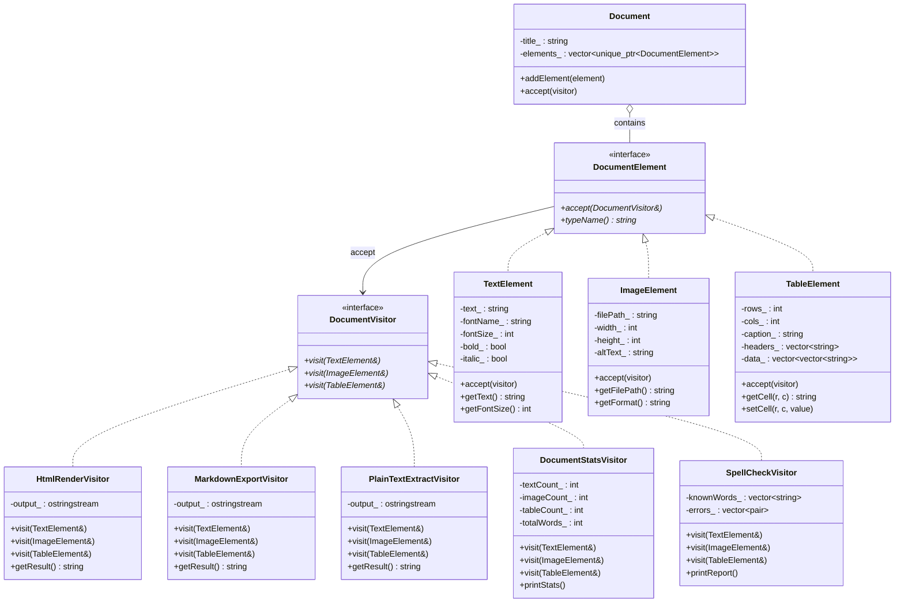
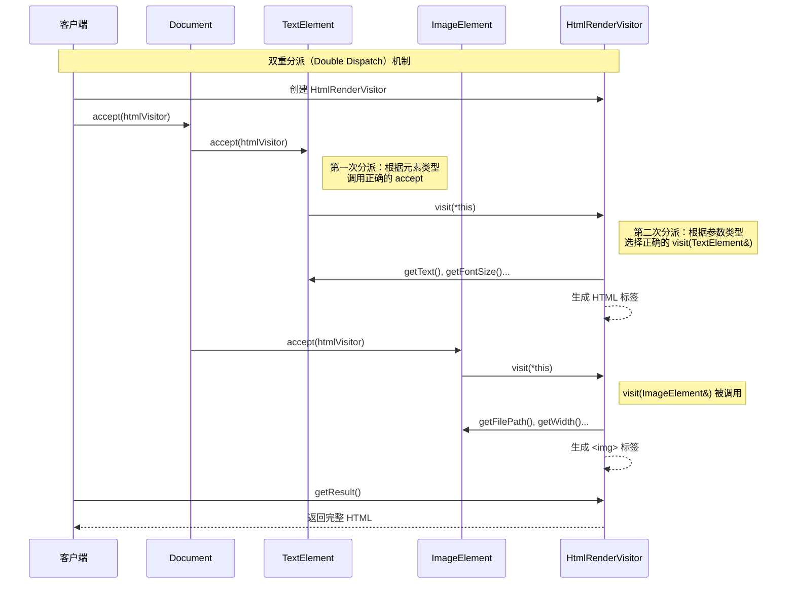

# 访问者模式（Visitor Pattern）

## 模式分类

> 访问者模式归属于**"行为变化"**分类。当需要在不修改已有元素类的前提下，为元素定义新的操作时，访问者模式通过将操作从元素类中提取到独立的访问者类，使得"行为的变化"（新增操作）不影响"结构的稳定"（元素层次）。这种在稳定的数据结构上灵活扩展操作的能力，是行为变化类模式的核心关注点。

## 问题背景

> 在文档处理系统中，文档由多种元素组成：文本段落、图片、表格等。系统需要对这些元素执行多种不同的操作：
>
> 1. **渲染为 HTML**：将元素转换为网页格式
> 2. **导出为 Markdown**：生成可读的文本格式
> 3. **拼写检查**：扫描文本内容找出拼写错误
> 4. **文档统计**：统计字数、图片数、表格单元数等
>
> 如果将所有这些操作都作为方法添加到元素类中，元素类会变得臃肿，且每次新增操作都需要修改所有元素类。更糟的是，渲染逻辑、导出逻辑、检查逻辑混杂在元素类中，违反了单一职责原则。

## 模式意图

> **GoF 定义**：表示一个作用于某对象结构中的各元素的操作。它使你可以在不改变各元素类的前提下定���作用于这些元素的新操作。
>
> **通俗解释**：元素类只需要提供一扇"门"（accept 方法），访问者带着自己的"工具"从这扇门进入，对元素执行操作。想增加新操作？只需要创建一个新的访问者类带着新工具来访问即可，元素类完全不需要改动。

## 类图

## 时序图

## 要点解析

1. **双重分派（Double Dispatch）**：C++ 只支持单分派（virtual 函数根据 this 指针类型选择），访问者模式通过 `accept(visitor)` + `visitor.visit(*this)` 两步调用实现了双重分派——既根据元素类型，又根据访问者类型，选择正确的操作。

2. **开闭原则的方向性**：访问者模式对"新增操作"开放（只需新增 Visitor 子类），但对"新增元素类型"封闭（需要修改所有已有 Visitor）。因此它适用于元素类型稳定、操作需要频繁扩展的场景。

3. **访问者可携带状态**：每个访问者对象可以在遍历过程中累积状态。如 `DocumentStatsVisitor` 累计计数，`HtmlRenderVisitor` 累积输出。这比在元素类中添加方法更灵活。

4. **元素暴露内部状态**：访问者需要通过元素的公开接口获取数据来执行操作，这可能会破坏封装性。需要在"元素类的封装"和"访问者的灵活性"之间取得平衡。

5. **与组合模式配合**：`Document` 作为容器管理一组 `DocumentElement`，`accept()` 遍历所有子元素。在更复杂的场景中，元素自身也可以包含子元素（如嵌套表格），形成树状结构。

## 示例代码说明

本目录下的 `Visitor.h` 和 `Visitor.cpp` 实现了一个文档处理系统：

**元素层（稳定）**：
- `TextElement`：文本段落，含字体、大小、粗体/斜体属性
- `ImageElement`：图片，含路径、尺寸、替代文本
- `TableElement`：表格，含表头、数据单元、标题

**访问者层（可扩展）**：
- `HtmlRenderVisitor`：渲染为完整的 HTML 标签
- `MarkdownExportVisitor`：导出为 Markdown 格式
- `PlainTextExtractVisitor`：提取可索引的纯文本
- `DocumentStatsVisitor`：统计字数、图片数等指标
- `SpellCheckVisitor`：检查拼写错误（内含简化字典）

`main()` 函数构建一份包含标题、段落、图片和表格的"季度销售报告"文档，然后依次用 5 种不同的访问者处理同一份文档，展示了在不修改任何元素类的情况下实现多种操作的能力。

## 开源项目中的应用

| 项目 | 应用场景 |
|------|---------|
| **LLVM/Clang** | `RecursiveASTVisitor` 遍历 AST 节点执行分析、变换操作，是 Clang 工具链的核心基础设施 |
| **Boost.Variant** | `boost::apply_visitor` 对 variant 类型的值���用访问者操作 |
| **Qt** | `QGraphicsScene` 中对图形项的遍历操作采用了访问者思想 |
| **GCC** | GIMPLE/RTL 中间表示使用 tree walker 遍历 AST，本质是访问者模式 |
| **Protocol Buffers** | 使用 Visitor 风格的 `Reflection` 接口遍历 message 的字段 |
| **std::visit (C++17)** | 标准库对 `std::variant` 的 `std::visit` 是访问者模式的直接体现 |

## 适用场���与注意事项

### 适用场景
- 对象结构（元素类型集合）**稳定**，但需要频繁新增操作
- 需要对一组不同类型的对象执行**统一遍历**，且操作逻辑差异大
- 操作需要**累积状态**（如统计、收集、生成输出）
- 希望将**数据结构与操作解耦**，保持元素类的简洁

### 不适用场景
- 元素类型**频繁变化**：每新增一种元素，所有访问者都要修改
- 元素层次结构很**简单**（只有 1-2 种），直接用虚函数更简洁
- 操作需要**修改**元素的私有状态，会导致过度暴露内部细节

### 与其他模式的对比

| 对比模式 | 区别 |
|---------|------|
| **策略模式** | 策略封装的是单一对象的算法变体，访问者封装的是作用于多种对象的操作 |
| **迭代器模式** | 迭代器负责遍历的"顺序"，访问者负责遍历时"做什么" |
| **组合模式** | 组合模式定义对象的树形结构，访问者在该结构上定义操作，两者常配合使用 |
| **命令模式** | 命令封装单个操作的请求，访问者封装作用于一组不同类型对象的操作 |
