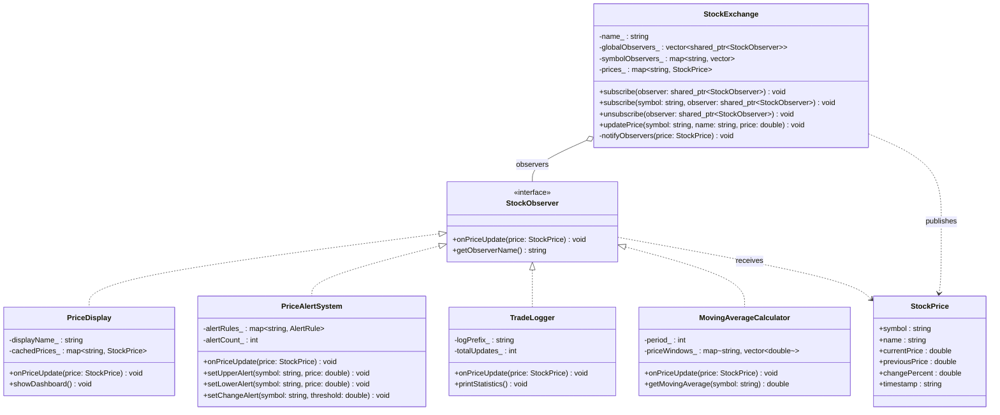
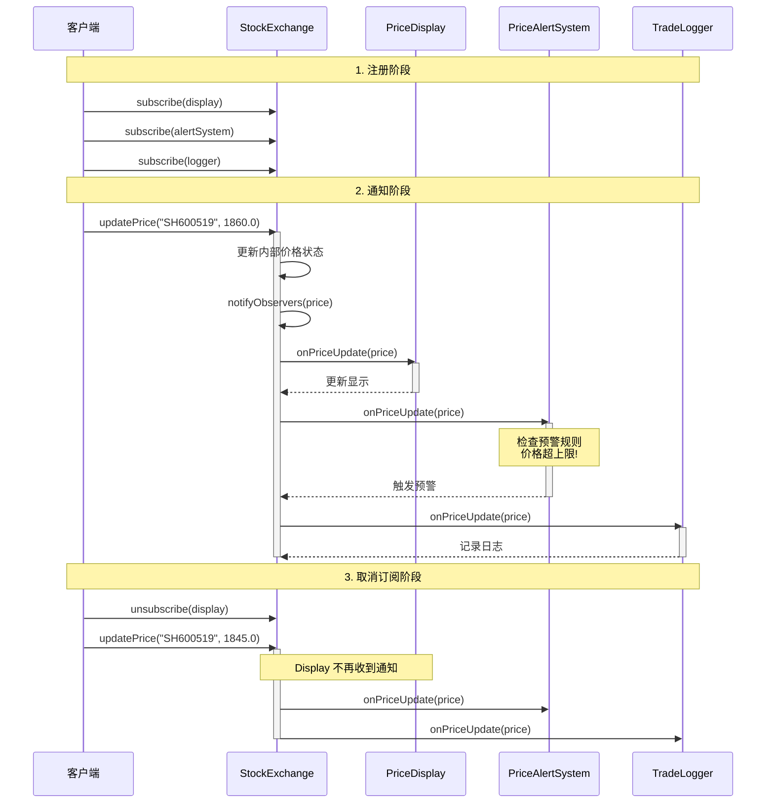

## 模式分类

> **组件协作（Component Collaboration）**
>
> 观察者模式属于"组件协作"分类。在软件构建过程中，需要为某些对象建立一种"通知依赖关系"——
> 一个对象（目标对象）的状态发生改变，所有依赖对象（观察者对象）都将自动收到通知。
> 观察者模式实现了**数据发布者与数据消费者之间的松耦合协作**，使得目标与观察者可以独立变化。

## 问题背景

> 假设我们正在开发一个股票交易系统。当股票价格发生变化时，需要同步更新多个组件：
>
> - **行情显示面板**：实时刷新价格
> - **价格预警系统**：检查是否触达预设阈值
> - **交易日志**：记录所有价格变动
> - **移动均线计算器**：重新计算技术指标
>
> 如果让交易所（数据源）直接调用每个组件的更新方法：
> ```cpp
> void updatePrice(double newPrice) {
>     display.refresh(newPrice);      // 硬编码依赖
>     alertSystem.check(newPrice);     // 硬编码依赖
>     logger.log(newPrice);            // 硬编码依赖
>     // 每新增一个组件都要修改这里...
> }
> ```
>
> 这种方法导致交易所与每个组件紧密耦合：新增组件必须修改交易所代码，移除组件也必须修改，
> 违反了开闭原则和依赖倒置原则。

## 模式意图

> **GoF 定义**：Define a one-to-many dependency between objects so that when one object
> changes state, all its dependents are notified and updated automatically.
>
> **通俗解释**：观察者模式就像微信公众号的订阅机制——你（观察者）关注了一个公众号（被观察者），
> 每当公众号发布新文章（状态改变），你就会自动收到推送（通知）。你可以随时取消关注（取消订阅），
> 公众号不需要知道你是谁，只负责给所有粉丝群发通知。

## 类图



## 时序图



## 要点解析

### 1. 松耦合（Loose Coupling）

`StockExchange` 只依赖 `StockObserver` 接口，不知道具体观察者的类型。
这意味着可以随时添加新类型的观察者（如量化交易引擎），而无需修改交易所的代码。

### 2. 推模型 vs 拉模型

- **推模型**（本示例采用）：Subject 在通知时主动推送完整的 `StockPrice` 数据给 Observer。
  - 优点：Observer 无需回调 Subject 获取数据，减少交互
  - 缺点：可能推送了 Observer 不需要的数据
- **拉模型**：Subject 只通知"数据已变化"，Observer 按需回调 `getPrice()` 获取数据。
  - 优点：Observer 只获取感兴趣的数据
  - 缺点：增加了交互次数

### 3. 生命周期管理

使用 `std::shared_ptr` 管理观察者的生命周期，避免 Subject 持有的指针变成悬垂指针。
这是 C++ 实现观察者模式时的关键考量（Java/C# 有 GC，无此问题）。

### 4. 细粒度订阅

除了全局订阅（关注所有股票），还支持按股票代码的细粒度订阅。
这避免了观察者收到大量不感兴趣的通知，提高了效率。

### 5. 观察者之间互相独立

`PriceDisplay`、`PriceAlertSystem`、`TradeLogger`、`MovingAverageCalculator` 互不依赖。
一个观察者的异常不会影响其他观察者的正常工作。

### 6. 通知顺序

当前实现按注册顺序通知观察者。在生产环境中，如果需要保证通知顺序或支持优先级，
可以引入优先级队列或责任链模式。

## 示例代码说明

本目录下的示例代码演示了一个股票交易系统场景：

- **`Observer.h`**：定义了观察者接口 `StockObserver`、被观察者 `StockExchange`、以及四个具体观察者类。

- **`Observer.cpp`**：
  - `StockExchange`：作为被观察者，管理观察者列表，支持全局和按股票代码的细粒度订阅/取消订阅。股价更新时自动通知所有相关观察者。
  - `PriceDisplay`：收到通知后更新行情显示面板，缓存最新价格以供面板展示。
  - `PriceAlertSystem`：根据预设的规则（上限、下限、涨跌幅阈值）检查股价，触发预警。
  - `TradeLogger`：记录每次价格变动的详细日志，统计上涨/下跌/持平次数。
  - `MovingAverageCalculator`：维护价格滑动窗口，计算简单移动平均线（SMA），检测价格偏离。
  - `main()` 函数展示了完整的订阅→通知→取消订阅流程。

## 开源项目中的应用

| 项目 | 类/机制 | 说明 |
|------|---------|------|
| **Qt Framework** | Signal & Slot 机制 | Qt 的信号槽本质是类型安全的观察者模式实现 |
| **Boost.Signals2** | `boost::signals2::signal` | 线程安全的信号/槽库，支持自动连接管理 |
| **C++ STL** | `std::condition_variable` | 底层的等待/通知机制 |
| **RxCpp** | ReactiveX 库 | 响应式编程，Observer 是其核心抽象 |
| **Google Protobuf** | `google::protobuf::Arena` 回调 | 对象生命周期通知 |
| **Redis** | Pub/Sub 机制 | 发布/订阅消息模式（分布式观察者） |
| **Linux Kernel** | `inotify` | 文件系统变更通知机制 |
| **MFC** | `CDocument/CView` | 文档/视图架构基于观察者模式 |

## 适用场景与注意事项

### 适用场景
- 一个对象的改变需要同时通知其他多个对象，且不知道具体有多少对象需要通知
- 需要在运行时动态建立对象间的依赖关系
- 对象间存在一对多的依赖关系
- 需要实现类似事件驱动的架构

### 不适用场景
- 观察者与被观察者之间的更新逻辑复杂且有顺序依赖（考虑中介者模式）
- 观察者数量巨大且通知非常频繁（考虑批量通知或节流机制）
- 需要保证通知的事务性（需要额外的事务管理机制）

### 与其他模式的对比

| 对比维度 | 观察者模式 | 中介者模式 | 发布-订阅模式 |
|----------|-----------|------------|---------------|
| 通信方向 | 一对多（Subject→Observers） | 多对多（通过中介者） | 多对多（通过消息代理） |
| 耦合度 | Subject 知道 Observer 接口 | 对象只知道中介者 | 发布者和订阅者完全解耦 |
| 适用范围 | 进程内 | 进程内 | 可跨进程/网络 |
| 通知机制 | 直接方法调用 | 通过中介者转发 | 通过消息队列/事件总线 |
| 复杂度 | 低 | 中 | 高 |

### 注意事项
1. **避免循环依赖**：如果 Observer A 的更新触发了 Subject 的再次通知，可能导致无限循环
2. **异常处理**：一个 Observer 的异常不应阻断其他 Observer 的通知
3. **内存泄漏**：C++ 中使用裸指针时，必须确保 Observer 析构前取消订阅
4. **线程安全**：多线程环境下，观察者列表的修改和通知需要同步保护
