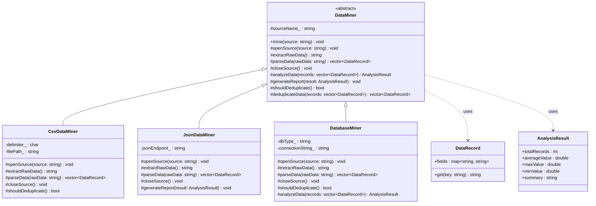
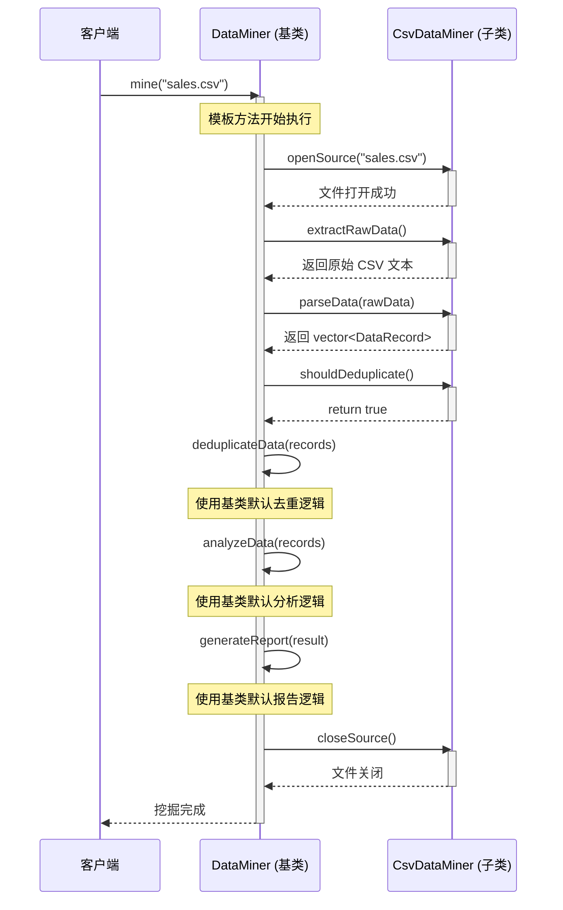

## 模式分类

> **组件协作（Component Collaboration）**
>
> 模板方法模式属于"组件协作"分类。在软件构建过程中，组件之间需要协作完成复杂任务。
> 模板方法通过将算法骨架固定在基类中，让子类实现可变步骤，实现了**框架（基类）与应用（子类）之间的协作**。
> 这是"晚期绑定"的经典体现——框架在编译时定义流程，具体行为在运行时由子类决定。

## 问题背景

> 假设我们正在开发一个数据挖掘系统，需要从多种数据源（CSV 文件、JSON API、数据库）
> 中提取并分析数据。每种数据源的挖掘流程都遵循相同的步骤：
>
> **打开数据源 → 提取原始数据 → 解析数据 → 分析数据 → 生成报告 → 关闭数据源**
>
> 如果在每个子类中独立实现整个流程，会导致大量重复代码，且任何流程变更都需要修改所有子类。
> 我们需要一种方式，在保持流程一致的前提下，允许各数据源自定义具体步骤的实现。

## 模式意图

> **GoF 定义**：Define the skeleton of an algorithm in an operation, deferring some steps to
> subclasses. Template Method lets subclasses redefine certain steps of an algorithm without
> changing the algorithm's structure.
>
> **通俗解释**：模板方法就像一条标准化的生产流水线——流水线的工序和顺序是固定的（由基类定义），
> 但每道工序的具体操作方式可以不同（由子类决定）。比如，"数据挖掘"的流水线始终是
> 打开→提取→解析→分析→报告→关闭，但 CSV、JSON、数据库各自用不同的方式执行每个步骤。

## 类图

## 时序图

## 要点解析

### 1. 稳定的算法骨架（Template Method）

`mine()` 方法是整个模式的核心。它定义了数据挖掘的完整流程，且这个流程对所有子类都是一致的。
关键在于：**变化的是步骤的实现，不变的是步骤的顺序**。

### 2. 纯虚函数 vs 钩子方法

- **纯虚函数**（`openSource`, `extractRawData`, `parseData`, `closeSource`）：子类必须实现，代表各数据源之间确实不同的步骤。
- **虚函数（带默认实现）**（`analyzeData`, `generateReport`）：提供合理的默认行为，子类可以选择性覆写。
- **钩子方法**（`shouldDeduplicate`）：返回布尔值，控制算法中的可选分支，赋予子类微调流程的能力，而不破坏整体结构。

### 3. 好莱坞原则（Hollywood Principle）

"Don't call us, we'll call you."——子类不主动调用基类，而是基类在 `mine()` 的执行过程中回调子类的方法。这种**控制反转（IoC）**是框架设计的基石。

### 4. 避免代码重复

所有数据挖掘器共享 `mine()` 中的流程控制逻辑、默认的分析和报告实现。
如果流程需要调整（如增加"数据校验"步骤），只需修改基类的 `mine()` 方法即可。

### 5. 开闭原则

对扩展开放（新增 `XmlDataMiner` 只需继承并实现纯虚函数），对修改关闭（无需修改已有代码）。

## 示例代码说明

本目录下的示例代码演示了一个数据挖掘流水线场景：

- **`TemplateMethod.h`**：定义了抽象基类 `DataMiner`，包含模板方法 `mine()` 以及各步骤的虚函数声明。同时定义了三个具体子类 `CsvDataMiner`、`JsonDataMiner`、`DatabaseMiner`。

- **`TemplateMethod.cpp`**：
  - `DataMiner::mine()` 实现了固定的六步流水线。
  - `CsvDataMiner` 模拟从 CSV 文件读取并解析数据，启用了去重功能。
  - `JsonDataMiner` 模拟从 JSON API 获取数据，覆写了 `generateReport()` 输出 JSON 格式报告。
  - `DatabaseMiner` 模拟数据库查询，覆写了 `analyzeData()` 增加了数据分布范围统计。
  - `main()` 函数依次使用三种挖掘器处理不同数据源，展示了相同流程、不同实现的效果。

## 开源项目中的应用

| 项目 | 类/方法 | 说明 |
|------|---------|------|
| **C++ STL** | `std::sort` 中的比较函数 | 排序算法骨架固定，比较策略由用户提供 |
| **Qt Framework** | `QWidget::paintEvent()` | Qt 定义了绘制流程，子类覆写 `paintEvent()` 实现自定义绘制 |
| **Google Test** | `Test::SetUp()` / `TearDown()` | 测试框架定义了 SetUp→Run→TearDown 的流程骨架 |
| **LLVM** | `Pass::runOnFunction()` | 编译器 Pass 框架定义了遍历流程，具体 Pass 覆写分析逻辑 |
| **Boost.Asio** | 异步操作的完成处理 | 异步 I/O 框架定义了操作流程，用户提供完成回调 |
| **MFC / ATL** | `CDialog::OnInitDialog()` | 对话框初始化流程固定，子类覆写特定步骤 |

## 适用场景与注意事项

### 适用场景
- 多个类有相同的算法结构，但某些步骤的实现不同
- 需要控制子类扩展的范围（只允许覆写特定步骤，不允许修改流程）
- 希望将公共行为提取到基类中，避免代码重复

### 不适用场景
- 算法步骤数量或顺序经常变化（此时应考虑策略模式或责任链模式）
- 子类之间的差异过大，共享的骨架代码很少
- 需要在运行时动态切换算法（应使用策略模式）

### 与其他模式的对比

| 对比维度 | 模板方法 | 策略模式 |
|----------|----------|----------|
| 粒度 | 控制整个算法流程 | 只替换算法中的一个步骤 |
| 绑定时机 | 编译时（继承） | 运行时（组合） |
| 扩展方式 | 继承基类，覆写步骤 | 实现策略接口，注入对象 |
| 类的数量 | 相对较少 | 可能较多（每个策略一个类） |
| 控制权 | 基类控制流程（好莱坞原则） | 客户端选择并注入策略 |
