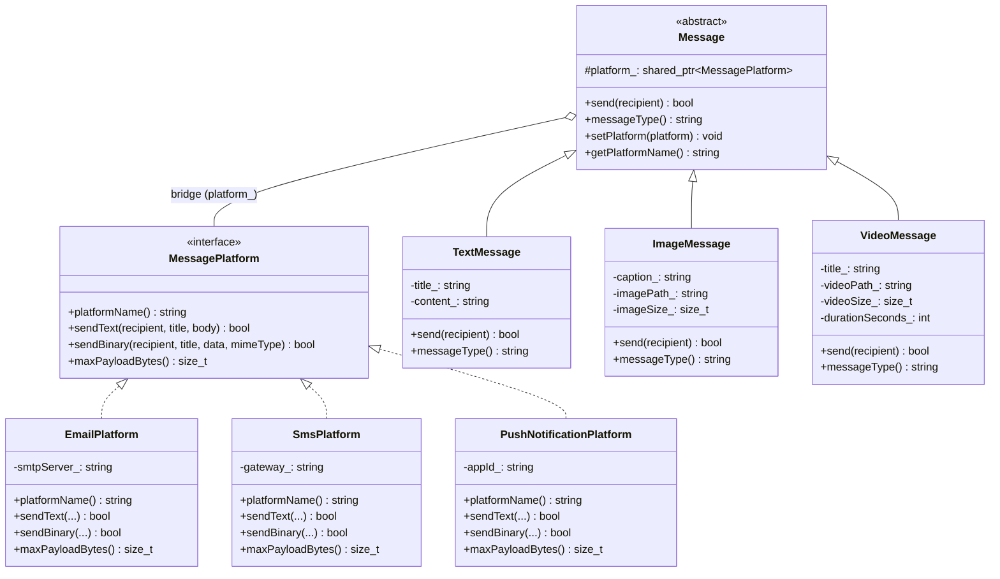
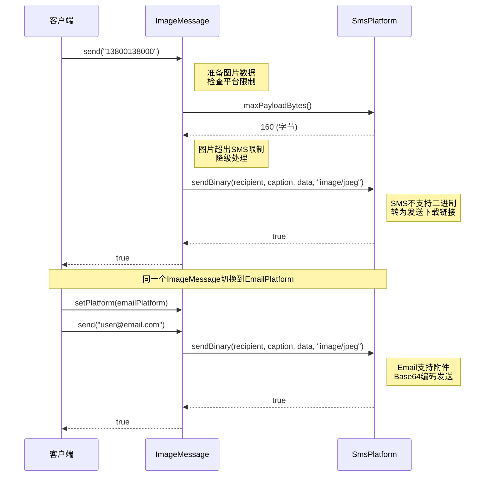

## 模式分类

> **归属于"单一职责"分类。**
>
> 桥接模式将系统中两个独立变化的维度（消息类型与发送平台）分离到各自的类层次中。消息类型只关心"发送什么内容"，发送平台只关心"怎么发送到目标"。每个类都只有一个变化的原因——消息类型因为内容格式变化而变化，发送平台因为通信协议变化而变化。这正是单一职责原则的体现。

## 问题背景

> 假设我们需要构建一个企业消息系统，支持多种**消息类型**（文本、图片、视频）和多种**发送平台**（电子邮件、短信、推送通知）。
>
> 如果用继承来实现所有组合：
> - `EmailTextMessage`、`EmailImageMessage`、`EmailVideoMessage`
> - `SmsTextMessage`、`SmsImageMessage`、`SmsVideoMessage`
> - `PushTextMessage`、`PushImageMessage`、`PushVideoMessage`
>
> 已经有 3 x 3 = 9 个类。当新增一种消息类型（如语音消息）或一种平台（如微信），类的数量就变成 4 x 4 = 16 个。两个维度的变化相乘导致类数量爆炸，且每个类中夹杂着两种不同的关注点——这就是需要桥接模式解决的问题。

## 模式意图

> **GoF 定义：** 将抽象部分与它的实现部分分离，使它们都可以独立地变化。
>
> **通俗解释：** 桥接模式就像一座桥，连接着两个独立发展的"岸"。一岸是"做什么"（消息类型），另一岸是"怎么做"（发送平台）。两岸各自建设，互不干扰。桥（组合关系）让它们能够协同工作，但不要求它们绑定在一起。这里的"实现"不是指代码实现，而是指对象组合中被委托的那一方。

## 类图

## 时序图

## 要点解析

### 1. 两个独立变化的维度

桥接模式适用于存在两个（或多个）正交变化维度的场景。在本例中：
- **抽象维度**（消息类型）：TextMessage、ImageMessage、VideoMessage——关注消息内容的组织和呈现
- **实现维度**（发送平台）：EmailPlatform、SmsPlatform、PushNotificationPlatform——关注底层的传输协议和限制

两个维度独立变化：新增消息类型无需修改平台代码，新增平台也无需修改消息代码。

### 2. 组合优于继承

桥接模式用 `Message` 持有 `shared_ptr<MessagePlatform>` 的组合关系替代了 M x N 的继承体系。M 种消息 + N 种平台只需 M + N 个类，而非 M x N 个。

### 3. 运行时平台切换

`setPlatform()` 方法允许在运行时更换发送平台，无需重新创建消息对象。这在批量分发场景中非常实用——同一条消息可以依次通过不同平台发送给不同接收者。

### 4. 智能指针的选择（shared_ptr）

与装饰器模式使用 `unique_ptr` 不同，这里使用 `shared_ptr` 是因为同一个平台实例可能被多个消息对象共享。例如多条消息都通过同一个 Email 平台发送，共享同一个 SMTP 连接配置是合理的。

### 5. 平台限制的优雅处理

消息类型可以查询平台的能力（如 `maxPayloadBytes()`），根据平台限制调整自己的行为（压缩、降级、转为链接等）。这种交互通过桥接的接口进行，不需要消息类型知道具体是哪个平台。

## 示例代码说明

本目录下的代码实现了一个跨平台消息系统的桥接模式：

- **Bridge.h** — 定义了两个维度的类层次：
  - `MessagePlatform` 接口及其三个实现：`EmailPlatform`（SMTP邮件）、`SmsPlatform`（短信网关）、`PushNotificationPlatform`（推送服务）
  - `Message` 抽象类及其三个细化：`TextMessage`（文本消息）、`ImageMessage`（图片消息）、`VideoMessage`（视频消息）
  - 桥接的关键：`Message` 持有 `shared_ptr<MessagePlatform>`

- **Bridge.cpp** — 实现所有类并包含4个演示场景：
  1. 同一条文本消息通过三种平台发送——展示运行时切换平台
  2. 三种消息类型通过邮件发送——展示消息类型维度的扩展
  3. 大视频消息在不同平台上的表现——展示平台限制导致的行为差异
  4. 批量消息分发——展示实际业务中的多消息 x 多平台应用

## 开源项目中的应用

| 项目 | 应用场景 |
|------|----------|
| **Qt Framework** | `QPaintDevice`（抽象维度）与 `QPaintEngine`（实现维度）的分离是经典桥接。`QWidget`、`QPixmap`等可绘制设备与 `QRasterPaintEngine`、`QOpenGLPaintEngine` 等绘制引擎独立变化 |
| **LLVM** | `Target`（目标架构）与 `TargetMachine`（机器码生成）的分离。不同的前端语言与后端架构通过中间表示（IR）桥接 |
| **Boost.Log** | 日志前端（记录器、过滤器）与后端（Sink——文件、控制台、网络）的分离，允许独立配置和替换 |
| **Java JDBC** | `DriverManager`（抽象）与各数据库厂商的 `Driver`（实现）的桥接，是桥接模式在数据库领域的经典应用 |
| **Linux 内核** | VFS（虚拟文件系统）作为抽象层，与 ext4、btrfs、xfs 等具体文件系统实现形成桥接关系 |

## 适用场景与注意事项

### 何时使用

- 系统存在两个或多个独立变化的维度，且它们需要组合使用
- 希望避免多层继承导致的类爆炸（M x N 问题）
- 需要在运行时切换实现（如切换发送平台、切换渲染引擎）
- 抽象部分和实现部分都需要通过子类扩展

### 何时不用

- 只有一个变化维度时，桥接模式会增加不必要的复杂性
- 两个维度之间存在强耦合（一种抽象只能配合特定实现）时，桥接的灵活性没有意义
- 系统规模小且不太可能扩展时，直接用简单继承更清晰

### 与其他模式的对比

| 对比维度 | 桥接模式 | 策略模式 | 抽象工厂模式 |
|----------|---------|---------|-------------|
| **目的** | 分离两个独立变化的维度 | 封装可互换的算法 | 创建一族相关对象 |
| **抽象层级** | 抽象和实现都有子类层次 | 策略是扁平的，无子类层次 | 关注对象的创建，而非操作 |
| **关系** | 抽象侧和实现侧是平等的伙伴 | 上下文拥有策略，策略是被使用的工具 | 工厂创建产品，关注创建过程 |
| **典型场景** | 多维度组合 | 单维度算法替换 | 跨平台 UI 组件族 |
