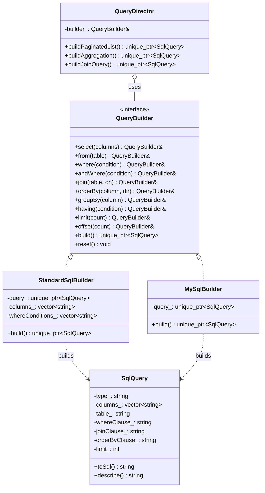
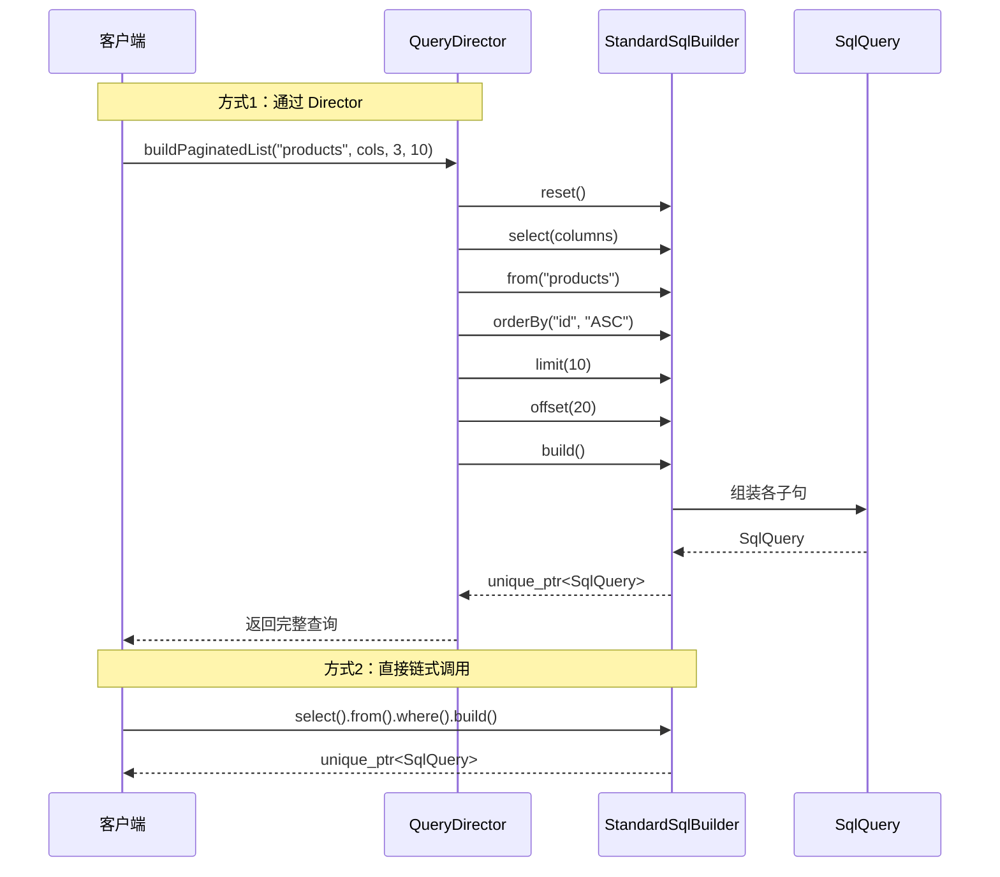

## 模式分类
> 归属于 **"对象创建"** 分类。建造者模式将一个复杂对象的 **构建过程** 与它的 **最终表示** 分离，使得同样的构建过程可以创建不同的表示。它特别适合那些由多个可选部分组成的复杂对象。

## 问题背景
> 你在开发一个 ORM 或数据库访问层，需要在代码中构建 SQL 查询语句。一条复杂的 SQL 查询可能包含：
>
> - SELECT 子句（选择哪些列）
> - FROM 子句（查询哪张表）
> - JOIN 子句（关联哪些表，可能有多个）
> - WHERE 子句（筛选条件，可能嵌套 AND/OR）
> - GROUP BY + HAVING 子句（分组统计）
> - ORDER BY 子句（排序，可能多列多方向）
> - LIMIT + OFFSET（分页）
>
> 问题在于：
> - 直接拼接字符串容易出错（忘记空格、逗号、关键字）
> - 不同数据库方言（MySQL、PostgreSQL、SQLite）的语法差异需要处理
> - "巨型构造函数"——一个参数列表极长的构造函数不可读且难以维护
> - 很多子句是可选的，但 SQL 语法要求特定的排列顺序

## 模式意图
> **GoF 定义**：将一个复杂对象的构建与它的表示分离，使得同样的构建过程可以创建不同的表示。
>
> **通俗解释**：建造者模式就像点餐系统——你告诉服务员"我要汉堡、加芝士、不要洋葱、大份薯条"，服务员（Director）把这些要求传给后厨（Builder），后厨按步骤组装好完整的套餐（Product）。你不需要知道汉堡是怎么做的。

## 类图

## 时序图

## 要点解析

1. **链式调用（Fluent Interface）**：每个构建方法返回 `QueryBuilder&`（自身引用），使得可以写出 `builder.select(...).from(...).where(...).build()` 这样的流畅代码。这是建造者模式在实践中最常见的变体。

2. **产品与构建过程分离**：`SqlQuery` 是一个简单的数据容器，只负责存储和渲染 SQL。所有的构建逻辑（条件组合、语法格式化）都在 Builder 中。

3. **多种表示**：同样的构建步骤（`select -> from -> where -> build`），`StandardSqlBuilder` 生成标准 SQL，`MySqlBuilder` 生成 MySQL 方言（反引号、特定语法）。这正是"同一构建过程，不同表示"的体现。

4. **Director 的作用**：`QueryDirector` 封装了常见的构建步骤序列（分页查询、聚合查询、关联查询），客户端不需要记住复杂的构建顺序。Director 是可选的——客户端也可以直接使用 Builder。

5. **`build()` 后自动重置**：调用 `build()` 后建造者自动 `reset()`，可以立即开始构建下一个查询。这避免了状态残留导致的 Bug。

6. **与"伸缩构造函数"的对比**：假设用构造函数来创建 SqlQuery，参数列表会是 `SqlQuery(type, columns, table, where, join, orderBy, groupBy, having, limit, offset)` ——绝大多数参数都是可选的，既不可读也不安全。Builder 完美解决了这个问题。

## 示例代码说明

- **`Builder.h`**：定义了产品类 `SqlQuery`、抽象建造者 `QueryBuilder`、两个具体建造者（`StandardSqlBuilder` 和 `MySqlBuilder`），以及导演类 `QueryDirector`。
- **`Builder.cpp`**：
  - `StandardSqlBuilder` 将各子句存储在内部容器中，`build()` 时统一组装成 `SqlQuery` 对象。
  - `MySqlBuilder` 在存储时就为标识符添加 MySQL 反引号，体现方言差异。
  - `QueryDirector` 提供了三种预定义查询模式，展示了 Director 封装构建流程的价值。
  - `main()` 演示了：手动链式构建、MySQL 方言对比、Director 预定义模式、建造者复用。

## 开源项目中的应用

| 项目 | 应用场景 |
|------|----------|
| **SQLite3** | `sqlite3_prepare_v2()` + `sqlite3_bind_*()` 系列函数实质上是逐步构建预编译语句 |
| **Qt Framework** | `QSqlQuery` 的参数绑定机制; `QString::arg()` 的链式替换也是建造者思想 |
| **Boost.Spirit** | 使用建造者风格的 DSL 逐步构建解析器规则 |
| **Protobuf** | `MessageBuilder` 逐步设置各字段，然后调用 `build()` 生成不可变的消息对象 |
| **gRPC** | `ChannelBuilder` 链式配置认证、压缩、超时等参数，最终构建 Channel 对象 |
| **LLVM** | `IRBuilder` 逐步插入 IR 指令（alloca、load、store、br 等），构建基本块和函数 |

## 适用场景与注意事项

### 适用场景
- 需要创建的对象包含多个可选组成部分
- 对象的创建步骤需要特定顺序
- 同一构建过程需要生成不同表示（如不同的 SQL 方言）
- 需要防止"伸缩构造函数"（参数爆炸的构造函数）

### 不适用场景
- 对象结构简单，直接使用构造函数即可
- 不需要步骤化构建，对象可以一次性创建
- 产品之间差异极大，无法共享构建步骤

### 与其他模式的对比
| 对比维度 | Builder | Abstract Factory | Prototype |
|----------|---------|------------------|-----------|
| 关注点 | 逐步构建一个复杂对象 | 创建一族相关对象 | 克隆现有对象 |
| 产品数量 | 一个复杂产品 | 多个相关产品 | 一个（副本） |
| 构建方式 | 多步骤 | 一步（工厂方法调用） | 一步（clone） |
| 典型特征 | 链式调用 / Director | 多个工厂方法 | clone() 方法 |
| 可变性 | 构建过程灵活 | 产品族固定 | 克隆后可修改 |
