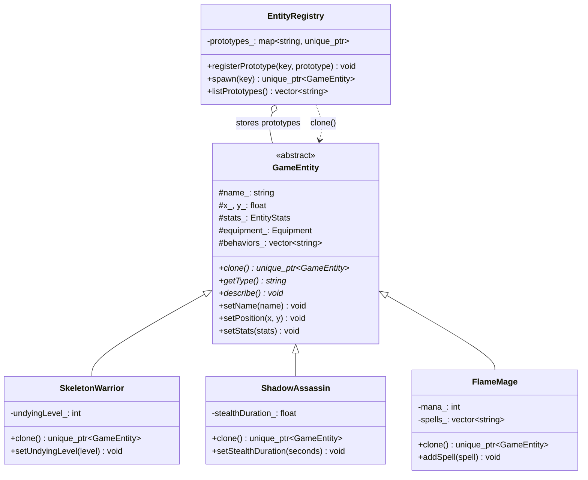
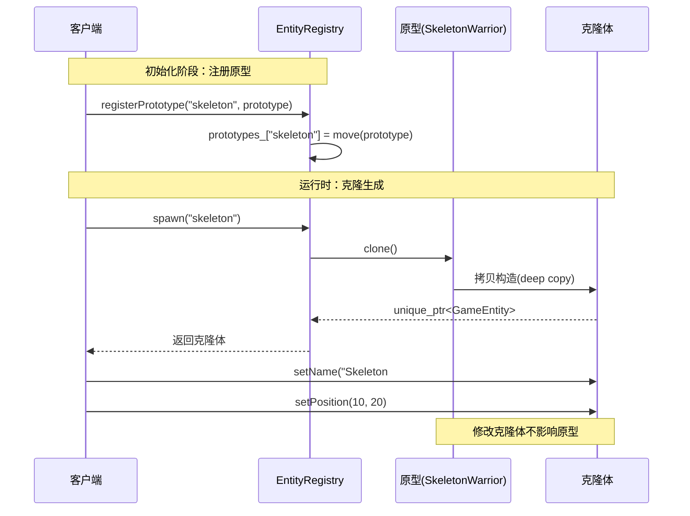

## 模式分类
> 归属于 **"对象创建"** 分类。原型模式通过 **复制（克隆）现有对象** 来创建新对象，而不是通过 `new` 从零构造。当对象的初始化过程复杂且耗时（如需要从配置文件加载大量属性、执行数据库查询等）时，克隆已配置好的原型比重新构造更高效。

## 问题背景
> 你在开发一款 RPG 游戏，需要在战斗场景中大量生成敌人和 NPC。每种敌人（骷髅战士、暗影刺客、火焰法师等）都有复杂的属性配置：
>
> - 基础数值（生命值、攻击力、防御力、速度、探测范围）
> - 装备（武器、护甲、饰品）
> - AI 行为列表（巡逻、攻击、逃跑策略）
> - 子类特有属性（骷髅的不死等级、刺客的隐身时间、法师的法力和技能列表）
>
> 问题在于：
> - 每次生成敌人都要重复设置大量属性，代码冗余
> - 策划可能在运行时通过 mod 系统定义新的敌人类型，无法在编译时确定所有类型
> - 直接使用构造函数 + setter 链过于繁琐，且容易遗漏

## 模式意图
> **GoF 定义**：用原型实例指定创建对象的种类，并且通过拷贝这些原型创建新的对象。
>
> **通俗解释**：先精心配置好一个"模板对象"（原型），之后需要同类型对象时，直接"复印"这个模板，然后微调即可。就像游戏中的怪物刷新点——每次刷出来的怪都是从模板克隆的。

## 类图

## 时序图

## 要点解析

1. **`clone()` 方法是核心**：每个具体原型类实现 `clone()`，内部使用 **拷贝构造函数** 创建副本。在 C++ 中，如果所有成员都是值类型或拥有正确拷贝语义的容器（如 `std::vector`、`std::string`），编译器生成的拷贝构造函数就能完成深拷贝。

2. **深拷贝 vs 浅拷贝**：如果类中包含裸指针成员，必须手动实现深拷贝。本例中使用 `std::string`、`std::vector` 等 RAII 类型，编译器自动生成的拷贝构造函数就是深拷贝。

3. **原型注册表（Registry）**：将原型集中管理，客户端通过字符串键查找原型并克隆。这使得系统可以在运行时动态注册新原型（如从 mod 文件加载），无需修改代码。

4. **协变返回类型的替代**：GoF 原书中 `clone()` 返回基类指针。现代 C++ 中返回 `std::unique_ptr<GameEntity>`，通过智能指针管理所有权。如需访问子类特有方法，可使用 `dynamic_cast`。

5. **克隆体的独立性**：克隆出的对象与原型完全独立，修改克隆体的属性不会影响原型。这在 `main()` 中通过名称独立性验证得到了演示。

## 示例代码说明

- **`Prototype.h`**：定义了 `GameEntity` 抽象基类（带 `clone()` 纯虚函数）、三种具体原型（`SkeletonWarrior`、`ShadowAssassin`、`FlameMage`）以及 `EntityRegistry` 原型注册表。
- **`Prototype.cpp`**：
  - 每种敌人的构造函数预配置了完整的默认属性（数值、装备、AI行为），模拟从策划配表加载的复杂初始化。
  - `clone()` 使用拷贝构造函数 `make_unique<T>(*this)` 实现深拷贝。
  - `main()` 演示了：注册普通/精英两种骷髅原型、批量克隆、克隆后自定义属性、深拷贝独立性验证。

## 开源项目中的应用

| 项目 | 应用场景 |
|------|----------|
| **Unreal Engine** | `UObject::DuplicateObject()` 用于克隆游戏对象，蓝图系统中的 Actor 模板就是原型模式的典型应用 |
| **Unity (C++)** | `Instantiate()` 函数本质上是克隆一个预配置的 Prefab（预制体），预制体就是原型 |
| **OpenCV** | `cv::Mat::clone()` 创建矩阵的深拷贝，避免浅拷贝导致的数据共享问题 |
| **Boost.Serialization** | 序列化 + 反序列化可视为一种原型克隆机制——将对象状态保存后重建 |
| **Qt Framework** | `QGraphicsItem` 可通过拷贝构造克隆图形项，在场景编辑器中用于复制粘贴操作 |
| **LLVM** | `Instruction::clone()` 克隆 IR 指令用于代码变换和优化 |

## 适用场景与注意事项

### 适用场景
- 对象的创建成本高昂（复杂初始化、大量属性配置、资源加载）
- 需要在运行时动态确定对象类型（如从配置文件加载）
- 需要大量相似对象，仅有少量属性差异
- 系统中对象的类层次结构复杂，不希望为每个类型编写专门的工厂

### 不适用场景
- 对象构造简单，直接 `new` 没有额外开销
- 类中包含无法拷贝的资源（如文件句柄、数据库连接），克隆没有意义
- 对象间需要共享状态而非独立副本

### 与其他模式的对比
| 对比维度 | 原型 | 工厂方法 | 抽象工厂 |
|----------|------|----------|----------|
| 创建机制 | 克隆现有对象 | 子类决定创建什么 | 工厂创建一族对象 |
| 运行时灵活性 | 高（可动态注册原型） | 中 | 中 |
| 需要子类化 | 不需要（只需实现 clone） | 需要（每个产品一个工厂子类） | 需要 |
| 典型搭配 | 原型注册表 + 享元 | 模板方法 | 工厂方法 |
