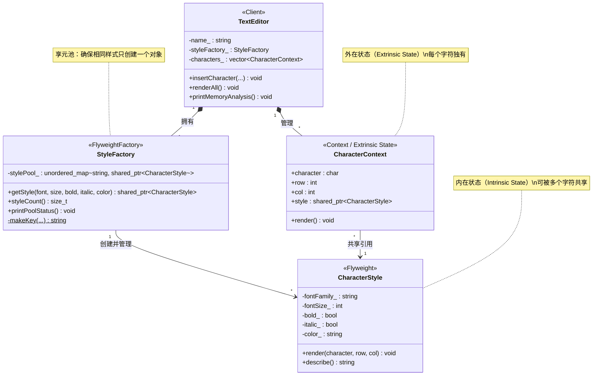
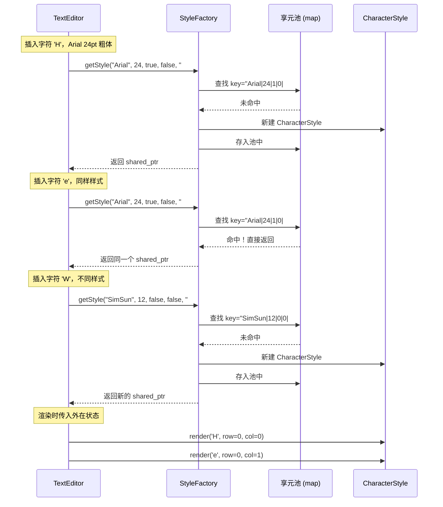

## 模式分类

> **对象性能（Object Performance）**
>
> Flyweight 属于"对象性能"分类，因为它直接针对**大量细粒度对象的内存开销**问题。通过共享对象的内在状态，显著减少内存占用，在对象数量巨大时（如文本编辑器中的百万字符）效果尤为明显。

## 问题背景

> 假设我们在开发一个文本编辑器，文档中每个字符都需要记录其字体、字号、是否加粗、是否斜体、颜色等样式信息。一篇 10 万字的文档就意味着 10 万个字符对象，每个对象都携带完整的样式数据。
>
> 问题在于：
> - 同一段落的字符通常共享相同的样式（比如正文都是"宋体 12pt 黑色"）
> - 10 万个字符可能只用了 5~10 种不同样式，但却存储了 10 万份样式数据
> - 内存浪费严重，GC 压力大（如果是托管语言），性能下降
>
> 我们需要一种方式，**让具有相同样式的字符共享同一个样式对象**，而不是每个字符都持有一份独立的副本。

## 模式意图

> **GoF 定义**：运用共享技术有效地支持大量细粒度的对象。
>
> **通俗解释**：就像围棋的棋子，虽然棋盘上有几百颗棋子，但只有"黑"和"白"两种——所有黑棋共享"黑色"这个属性，所有白棋共享"白色"这个属性。不同的只是每颗棋子的位置。Flyweight 模式就是把**不变的共性**提取出来共享，把**变化的个性**留在外部。

## 类图



## 时序图



## 要点解析

### 1. 内在状态 vs 外在状态

这是 Flyweight 模式最核心的概念：

| 分类 | 定义 | 本例中 | 存储位置 |
|------|------|--------|----------|
| **内在状态（Intrinsic）** | 不随上下文变化，可被共享的数据 | 字体、字号、粗体、斜体、颜色 | Flyweight 对象内部 |
| **外在状态（Extrinsic）** | 随上下文变化，不可共享的数据 | 字符值、行号、列号 | Context 对象中 |

正确区分内在/外在状态是使用 Flyweight 的关键。如果把外在状态也放进 Flyweight，就无法共享了。

### 2. 享元工厂（Flyweight Factory）

```cpp
std::shared_ptr<CharacterStyle> StyleFactory::getStyle(...) {
    std::string key = makeKey(fontFamily, fontSize, bold, italic, color);
    auto it = stylePool_.find(key);
    if (it != stylePool_.end()) {
        return it->second;  // 命中缓存，直接复用
    }
    auto style = std::make_shared<CharacterStyle>(...);
    stylePool_[key] = style;
    return style;
}
```

工厂维护一个**享元池**（`unordered_map`），将内在状态的组合作为 key。客户端不直接 `new` Flyweight 对象，而是通过工厂获取——这样工厂可以决定是创建新对象还是返回已有对象。

### 3. 使用 `shared_ptr` 管理生命周期

享元对象被多个 Context 共享引用，使用 `std::shared_ptr` 是自然的选择：
- 引用计数自动管理生命周期
- 当所有引用方都不再使用某个样式时，自动释放
- 可通过 `use_count()` 查看有多少字符在共享这个样式

### 4. Flyweight 的操作接口

Flyweight 对象（`CharacterStyle`）的 `render()` 方法接受外在状态作为参数：

```cpp
void render(char character, int row, int col) const;
```

Flyweight 本身不存储外在状态，而是在需要时由调用者传入。这是"享元"能被共享的前提。

### 5. 内存节省效果

在本例的大规模文档演示中：
- 1000 个字符只创建了 4 个 `CharacterStyle` 对象
- 如果不使用 Flyweight，需要 1000 个样式对象
- 对象数量减少了 99.6%，内存节省显著

## 示例代码说明

本目录下的示例模拟了一个文本编辑器的字符渲染系统：

- **`CharacterStyle`（Flyweight）**：存储字体、字号、粗体、斜体、颜色等内在状态。提供 `render()` 方法，接受外在状态（字符值和位置）进行渲染。

- **`StyleFactory`（Flyweight Factory）**：维护享元池 `stylePool_`，使用内在状态组合生成唯一 key。`getStyle()` 方法实现"有则复用、无则创建"的逻辑。

- **`CharacterContext`（Context）**：存储外在状态（字符值、行号、列号）以及指向共享 `CharacterStyle` 的 `shared_ptr`。

- **`TextEditor`（Client）**：管理字符集合和样式工厂。`insertCharacter()` 通过工厂获取共享样式，`printMemoryAnalysis()` 对比展示使用和不使用 Flyweight 的内存差异。

- **`main()` 函数**：
  1. 小规模演示：插入带不同样式的标题、正文、注释文字，展示样式共享过程
  2. 大规模演示：插入 1000 个字符但仅使用 4 种样式，展示内存节省效果

## 开源项目中的应用

| 项目 | 使用场景 | 说明 |
|------|----------|------|
| **Qt** | 隐式共享（Implicit Sharing / COW） | `QString`、`QImage` 等使用 `QSharedData` 实现写时复制，本质是 Flyweight 思想 |
| **Boost** | `Boost.Flyweight` | 提供了通用的 Flyweight 模板库，支持自定义 key 提取、工厂策略和并发策略 |
| **LLVM** | `StringRef` / `Twine` | 字符串引用避免复制，多个 IR 节点共享相同的字符串字面量 |
| **Java** | `String.intern()` | 字符串驻留池，相同内容的字符串共享同一对象 |
| **JVM** | `Integer.valueOf()` | -128 到 127 的整数对象预创建并缓存，共享使用 |
| **游戏引擎** | 纹理/材质共享 | Unity、Unreal 中相同纹理资源只加载一次，多个游戏对象共享引用 |

## 适用场景与注意事项

### 适用场景
- **大量相似对象**：程序中存在大量相似或相同的小对象，且其中大部分状态可以外部化
- **对象数量庞大**：对象数量达到数千甚至数百万级别，内存成为瓶颈
- **状态可分离**：对象状态能明确区分为"可共享的内在状态"和"不可共享的外在状态"
- 典型场景：文字渲染、棋类游戏棋子、地图瓦片、粒子系统

### 注意事项
- **区分状态是前提**：如果内在/外在状态无法清晰分离，不要强行使用 Flyweight
- **增加了复杂性**：引入了工厂、享元池、Context 等额外结构
- **线程安全**：多线程环境下享元池的访问需要加锁
- **不适合可变对象**：如果 Flyweight 的内在状态可能变化，会影响所有引用者

### 与其他模式的对比

| 对比维度 | Flyweight | Singleton | Prototype | 对象池 |
|----------|-----------|-----------|-----------|--------|
| 共享目的 | 减少内存占用 | 保证唯一实例 | 通过克隆创建对象 | 复用昂贵对象 |
| 对象数量 | 多种共享对象 | 只有一个 | 原型可多个 | 池中固定数量 |
| 可变性 | 内在状态不可变 | 通常可变 | 克隆后可变 | 可变 |
| 关注点 | 内存效率 | 全局唯一性 | 创建效率 | 创建+回收效率 |