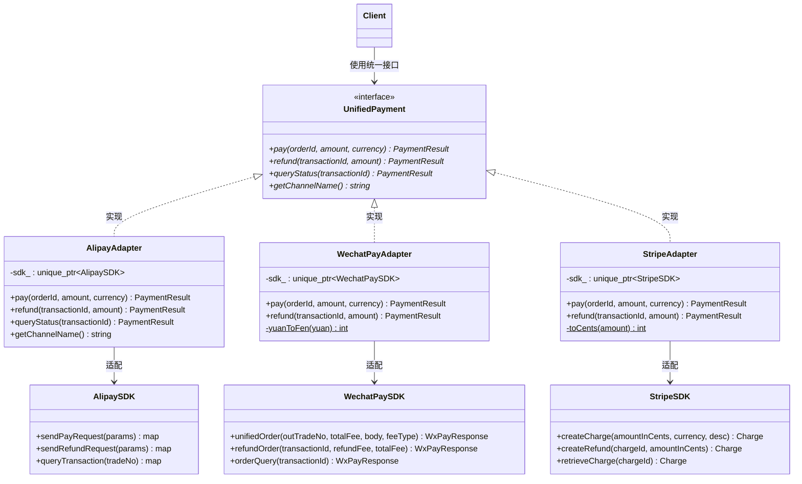
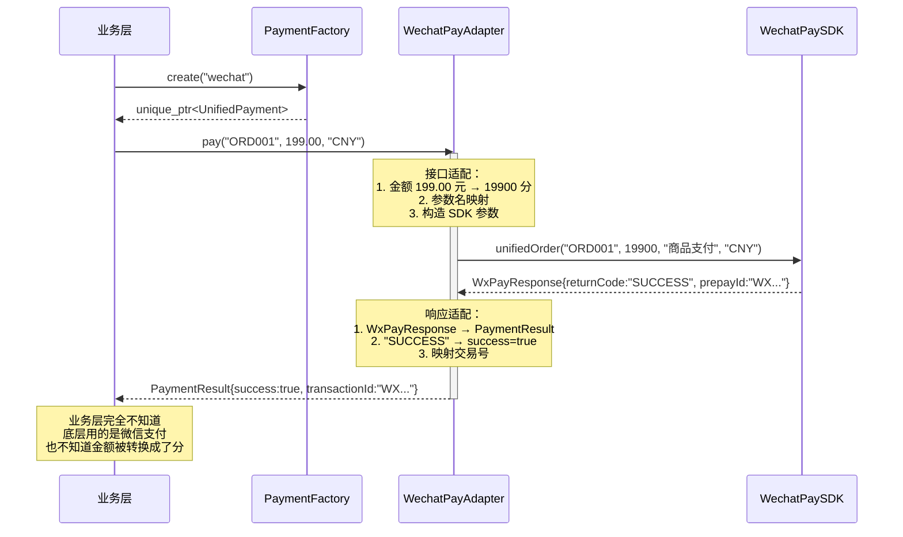

## 模式分类

> 归属于 **"接口隔离"** 分类。Adapter 模式的核心是在两个不兼容的接口之间建立一个转换层，使客户端不需要直接面对不兼容的第三方接口。适配器将"我们的标准接口"与"第三方的非标准接口"隔离开来，客户端只依赖于统一接口，完全不知道背后适配了哪个具体 SDK。这种通过接口转换实现的依赖隔离，是接口隔离思想的经典应用。

## 问题背景

> 假设你在开发一个电商平台的支付模块。平台需要同时支持支付宝、微信支付、Stripe 等多个支付渠道。问题是，每个支付 SDK 的接口完全不同：
>
> - **支付宝**：参数和返回值都是 `map<string, string>`，成功码是 `"10000"`
> - **微信支付**：金额单位是"分"（而非"元"），用自定义的响应结构体，成功标志是 `"SUCCESS"`
> - **Stripe**：金额单位是"美分"，使用英文接口，错误通过异常抛出
>
> 如果业务代码直接调用这些 SDK，会出现大量 `if (channel == "alipay") ... else if (channel == "wechat") ...` 的分支逻辑，难以维护，且每新增一个支付渠道都需要修改业务层代码。

## 模式意图

> **GoF 定义**：将一个类的接口转换成客户希望的另外一个接口。Adapter 模式使得原本由于接口不兼容而不能一起工作的那些类可以一起工作。
>
> **通俗解释**：Adapter（适配器）就像电源转换插头。你有一个中国标准的三脚插头（我们的统一接口），要插到美国标准的两脚插座（Stripe SDK）上。适配器把三脚转换成两脚，你不需要换插头（修改业务代码），也不需要换插座（修改第三方 SDK）。

## 类图



## 时序图



## 要点解析

### 1. 对象适配器 vs 类适配器
本示例使用**对象适配器**（通过组合持有被适配对象），而非类适配器（通过多重继承）。原因：
- C++ 多重继承容易引发菱形继承问题
- 对象适配器更灵活，可以适配被适配类的所有子类
- 运行时可以切换被适配对象

### 2. 适配器承担的转换工作
适配器不只是简单的方法转发，它承担了关键的数据转换任务：
- **数据格式转换**：`double`（元）→ `int`（分/美分）
- **参数名映射**：`orderId` → `out_trade_no` / `outTradeNo`
- **返回值转换**：`map` / `WxPayResponse` / `Charge` → `PaymentResult`
- **错误处理适配**：异常 → 返回值

### 3. 符合开闭原则
新增支付渠道（如 PayPal）只需：
1. 引入 PayPal SDK（Adaptee）
2. 编写 `PayPalAdapter`（实现 `UnifiedPayment`）
3. 在 `PaymentFactory` 中注册

整个过程不需要修改业务层代码和已有的适配器。

### 4. 适配器的职责边界
适配器只做"接口转换"，不做"业务逻辑"。如果适配器中出现了复杂的业务判断（如根据金额选择不同的支付方式），说明职责已经越界。

### 5. 与工厂模式的配合
本示例中 `PaymentFactory` 负责根据渠道名创建对应的适配器，将"选择哪个适配器"的逻辑集中管理。Adapter + Factory 是实际项目中非常常见的组合。

## 示例代码说明

本目录下的代码实现了第三方支付适配：

- **`Adapter.h`**：定义统一接口 `UnifiedPayment`（Target）、3 个第三方 SDK（Adaptee）和 3 个适配器（Adapter）
- **`Adapter.cpp`**：实现所有 SDK 和适配器 + 4 个演示场景

核心适配逻辑（以微信支付为例）：
```cpp
PaymentResult WechatPayAdapter::pay(const std::string& orderId,
                                     double amount, const std::string& currency) {
    int totalFee = yuanToFen(amount);  // 元 → 分
    auto response = sdk_->unifiedOrder(orderId, totalFee, "商品支付", currency);

    PaymentResult result;
    result.success = (response.returnCode == "SUCCESS");  // 响应格式转换
    result.transactionId = response.prepayId;
    return result;
}
```

4 个演示场景：
1. 支付宝支付（map 接口适配）
2. 微信支付（分/元转换 + 结构体适配）
3. Stripe 支付（美分转换 + 异常处理适配）
4. 多态批量处理（展示业务层与 SDK 完全解耦）

## 开源项目中的应用

| 项目 | 应用场景 |
|------|----------|
| **STL** | `std::stack` 和 `std::queue` 是容器适配器，将 `deque` 等底层容器适配为栈/队列接口 |
| **Qt** | `QAbstractItemModel` 体系中，`QSortFilterProxyModel` 适配（并扩展）了模型接口；`QDataStream` 将不同平台的字节序适配为统一的序列化接口 |
| **Boost** | `boost::function` 将函数指针、函数对象、lambda 等不同可调用体适配为统一接口 |
| **LLVM** | `llvm::iterator_adaptor_base` 用于将底层迭代器适配为特定遍历模式的迭代器 |
| **gRPC** | 客户端 Stub 将不同语言的本地调用适配为统一的 RPC 调用接口 |

## 适用场景与注意事项

### 适用场景
- 需要集成多个接口不兼容的第三方库或 SDK
- 希望复用现有类，但其接口与当前系统不匹配
- 需要创建一个可复用的类，该类可以与未来可能出现的不兼容类协作

### 不适用场景
- 如果可以修改目标接口或被适配类的源码，直接修改可能更简单
- 接口差异过大时（不只是参数名不同，而是语义完全不同），强行适配会导致信息丢失或语义扭曲
- 只有一个外部 SDK，且不太可能更换，直接依赖可能更实际

### 与其他模式对比

| 对比维度 | Adapter | Facade | Proxy | Bridge |
|---------|---------|--------|-------|--------|
| **目的** | 转换接口 | 简化接口 | 控制访问 | 分离抽象与实现 |
| **被适配方** | 已有的不兼容类 | 复杂子系统 | 相同接口的真实对象 | 可变的实现层 |
| **客户端接口** | 定义新接口 | 定义简化接口 | 与真实对象相同 | 抽象层接口 |
| **转换类型** | 接口格式转换 | 接口数量缩减 | 无转换（相同接口） | 实现策略切换 |
| **典型场景** | 第三方 SDK 集成 | 复杂系统入口 | 延迟加载/权限控制 | 跨平台渲染 |
