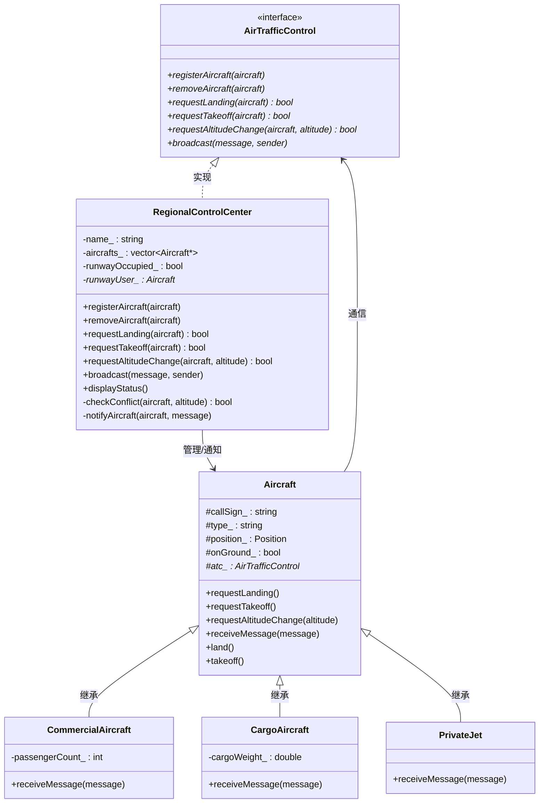
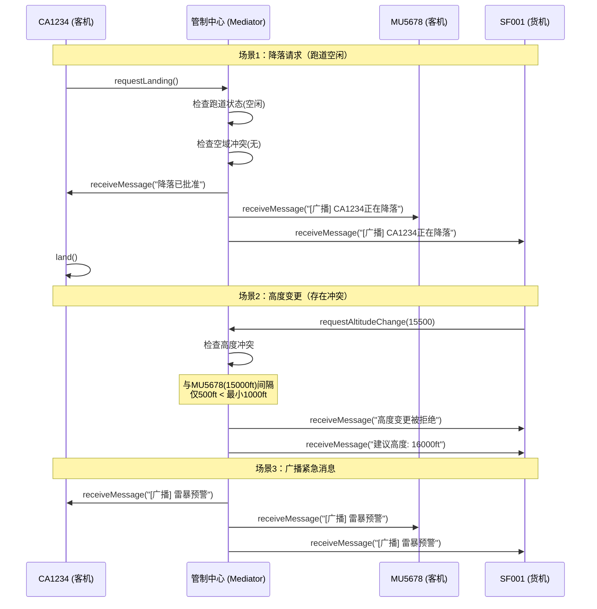

## 模式分类

> 归属于 **"接口隔离"** 分类。Mediator 模式通过引入一个中介对象，将原本多个对象之间复杂的网状交互（N*N）简化为每个对象只与中介者交互的星型结构（N*1）。对象之间不再需要彼此了解，它们只需知道中介者的接口。这种将"对象间直接依赖"转化为"对象与中介者间的单一依赖"的做法，是接口隔离思想的重要体现。

## 问题背景

> 假设你在开发一套空中交通管制系统。空域中同时有多架飞机，它们需要协调以下问题：
>
> - 跑道使用：同一时刻只能有一架飞机使用跑道降落或起飞
> - 高度冲突：相邻高度层的飞机需要保持至少 1000 英尺的垂直间隔
> - 安全距离：飞机之间需要保持最小安全距离
>
> 如果让飞机之间直接相互通信来协调这些问题：
> - 每架飞机都需要知道所有其他飞机的存在
> - N 架飞机形成 N*(N-1)/2 条通信链路，复杂度爆炸
> - 新增一架飞机需要修改所有已有飞机的代码
> - 协调逻辑分散在每架飞机中，难以维护

## 模式意图

> **GoF 定义**：用一个中介对象来封装一系列的对象交互。中介者使各对象不需要显式地相互引用，从而使其耦合松散，而且可以独立地改变它们之间的交互。
>
> **通俗解释**：Mediator（中介者）就像机场的空中交通管制塔台。飞行员不需要与其他所有飞行员通话协调——他们只需与塔台通话。塔台掌握所有飞机的位置和状态，统一做出调度决策。这把 N 架飞机之间的 N*(N-1)/2 条通信链路，简化为 N 条与塔台的通信链路。

## 类图



## 时序图



## 要点解析

### 1. 网状结构 → 星型结构
没有中介者时，N 架飞机之间有 N*(N-1)/2 条通信链路。引入塔台后，只有 N 条链路。复杂度从 O(N^2) 降到 O(N)。

### 2. 同事对象只认识中介者
`Aircraft` 类只持有 `AirTrafficControl*`，不持有任何其他 `Aircraft` 的引用。飞机发出请求时（如 `requestLanding()`），只是通知塔台，由塔台决定如何协调。

### 3. 协调逻辑集中在中介者
所有冲突检测、跑道管理、广播通知的逻辑都集中在 `RegionalControlCenter` 中。这使得协调规则容易修改和测试——只需修改中介者，不需要改动任何飞机类。

### 4. "中介者膨胀"风险
由于所有协调逻辑集中在中介者中，中介者可能变得过于复杂（"上帝对象"）。实际项目中可以将中介者内部再次拆分为多个策略类（如 `ConflictDetector`、`RunwayManager`）。

### 5. 可观察性
中介者天然是系统状态的汇聚点，非常适合实现状态监控和日志记录（如 `displayStatus()` 方法）。

## 示例代码说明

本目录下的代码实现了空中交通管制中介者：

- **`Mediator.h`**：定义了 `AirTrafficControl` 接口（Mediator）、`Aircraft` 基类（Colleague）和 3 种具体飞机类型
- **`Mediator.cpp`**：实现所有类 + 6 个演示场景

核心交互模式：
```cpp
// 飞机只通过中介者发出请求
void Aircraft::requestLanding() {
    atc_->requestLanding(this);  // 委托给中介者
}

// 中介者封装所有协调逻辑
bool RegionalControlCenter::requestLanding(Aircraft* aircraft) {
    if (runwayOccupied_) {
        notifyAircraft(aircraft, "跑道被占用");
        notifyAircraft(runwayUser_, "请尽快完成");  // 协调其他飞机
        return false;
    }
    // ... 冲突检测、批准降落、广播通知
}
```

6 个演示场景覆盖了：降落请求、跑道冲突、起飞请求、高度冲突检测、无冲突高度变更、紧急广播。

## 开源项目中的应用

| 项目 | 应用场景 |
|------|----------|
| **Qt** | `QSignalMapper`（已废弃）曾是典型的中介者；现代 Qt 中 `QDialogButtonBox` 作为多个按钮与对话框之间的中介者 |
| **Boost.Signals2** | 信号/槽机制本质上是一种中介者模式的泛化实现 |
| **MFC** | `CDialog` 类作为对话框中所有控件之间的中介者，协调控件交互 |
| **Linux Kernel** | 设备驱动框架中的总线（Bus）充当设备和驱动之间的中介者 |
| **ROS** | `roscore` 作为所有 ROS 节点之间的中介者，协调节点发现和消息路由 |

## 适用场景与注意事项

### 适用场景
- 多个对象之间存在复杂的交互关系，形成网状依赖
- 想要复用某些对象，但因为它们与太多其他对象耦合而无法复用
- 交互逻辑需要经常变更，集中管理比分散管理更容易维护

### 不适用场景
- 对象之间交互简单（只有 2-3 个对象），引入中介者反而增加复杂度
- 对象间的交互不会变化，没有必要引入中间层
- 中介者可能变成"上帝对象"，需要注意控制其复杂度

### 与其他模式对比

| 对比维度 | Mediator | Observer | Facade |
|---------|----------|----------|--------|
| **通信方向** | 双向（同事 ↔ 中介者） | 单向（主题 → 观察者） | 单向（客户端 → 子系统） |
| **关注点** | 对象间协调逻辑 | 状态变化通知 | 接口简化 |
| **参与者关系** | 同事对象是对等的 | 主题和观察者不对等 | 子系统之间可以不相关 |
| **知晓对方** | 同事知道中介者存在 | 主题不知道观察者具体类型 | 子系统不知道 Facade 存在 |
