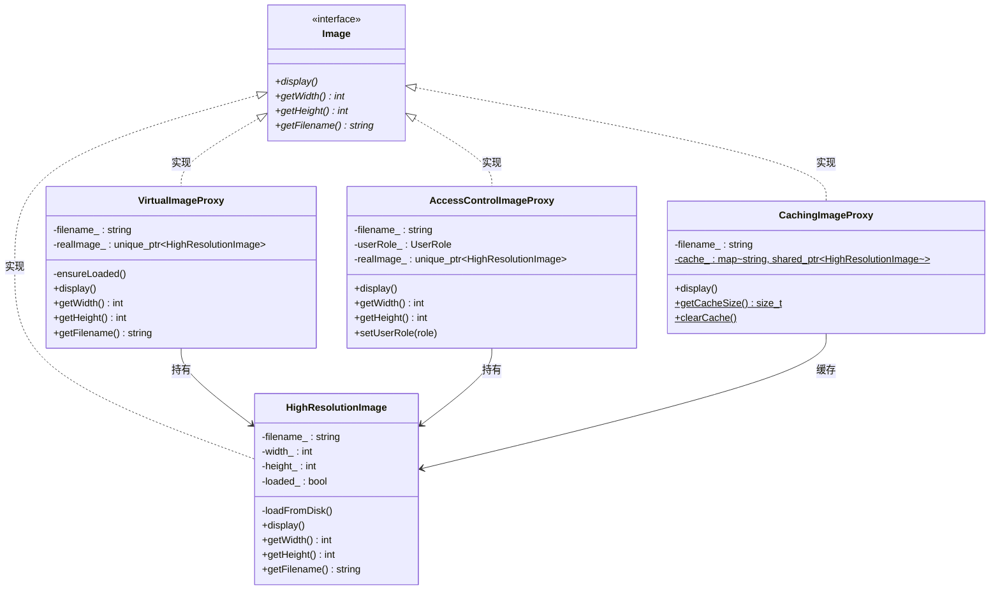
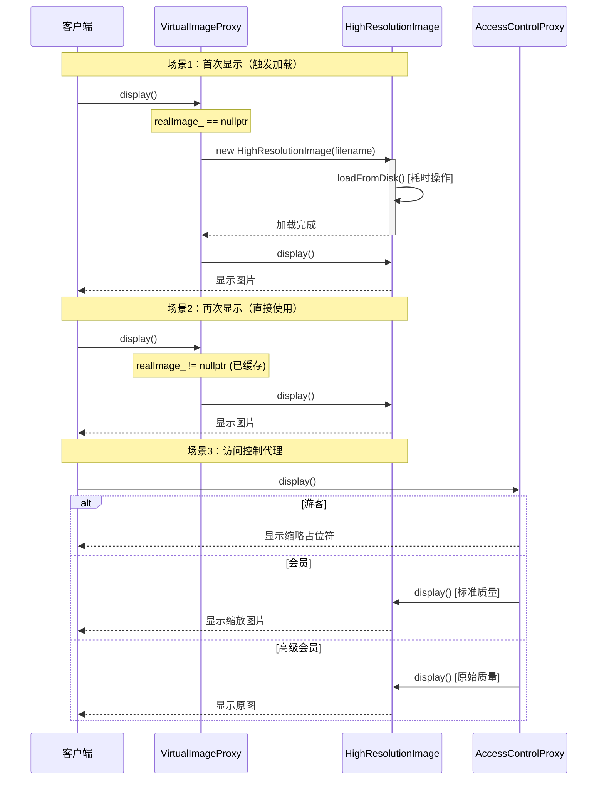

## 模式分类

> 归属于 **"接口隔离"** 分类。Proxy 模式通过在客户端和真实对象之间插入一个代理层，控制客户端对真实对象的访问。代理与真实对象实现相同的接口，客户端无需感知代理的存在。这种"接口一致的隔离层"正是接口隔离思想的典型应用——通过代理隔离了客户端对真实对象的直接依赖，可以在不修改任何一方的情况下增加延迟加载、访问控制、缓存等能力。

## 问题背景

> 假设你正在开发一个图片浏览器应用。相册中有几百张高分辨率图片（每张几十 MB），如果在打开相册时全部加载到内存，会导致：
>
> 1. 启动时间极长（等待所有图片从磁盘读取）
> 2. 内存占用巨大（可能耗尽系统内存）
> 3. 用户可能只看其中几张图片，其余加载都是浪费
>
> 同时，还有权限问题：部分图片只有付费会员才能查看原图，游客只能看缩略预览。如何在不修改图片类本身的前提下，增加延迟加载和权限控制？

## 模式意图

> **GoF 定义**：为其他对象提供一种代理以控制对这个对象的访问。
>
> **通俗解释**：Proxy（代理）就像一个"门卫"或"经纪人"。你想见明星（真实对象），必须先通过经纪人（代理）。经纪人可以决定你什么时候能见（延迟加载）、有没有资格见（访问控制）、以及是否需要重复见（缓存）。但在你看来，和经纪人的沟通方式与直接和明星沟通完全一样（相同接口）。

## 类图



## 时序图



## 要点解析

### 1. 代理与真实对象的接口一致性
代理类和真实对象都实现相同的 `Image` 接口。客户端通过 `Image*` 或 `Image&` 操作，完全无法区分自己用的是代理还是真实对象。这就是"透明代理"的核心。

### 2. 虚拟代理的惰性初始化
`VirtualImageProxy` 在构造时不创建 `HighResolutionImage`，只在第一次调用 `display()` 时才创建。`realImage_` 被声明为 `mutable`，使得即使在 `const` 方法（如 `getWidth()`）中也能触发惰性加载。

### 3. 访问控制代理的开闭原则
`AccessControlImageProxy` 在不修改 `HighResolutionImage` 的前提下，增加了权限检查逻辑。这完美体现了开闭原则：对扩展开放（新增代理类），对修改关闭（不改真实对象）。

### 4. 缓存代理的共享策略
`CachingImageProxy` 使用 `static` 缓存池和 `shared_ptr`，确保同一文件名的图片只加载一次。多个代理实例可以共享同一个真实对象。

### 5. `unique_ptr` vs `shared_ptr` 的选择
- 虚拟代理和访问控制代理使用 `unique_ptr`：一对一关系，代理独占真实对象
- 缓存代理使用 `shared_ptr`：多个代理可能共享同一个真实对象

## 示例代码说明

本目录下的代码实现了 3 种代理：

- **`Proxy.h`**：定义了 `Image` 接口（Subject）、`HighResolutionImage`（RealSubject）和 3 种代理
- **`Proxy.cpp`**：完整实现 + 4 个演示场景

三种代理的核心区别：
```cpp
// 虚拟代理：延迟创建
void VirtualImageProxy::display() {
    if (!realImage_) {                                    // 首次调用才加载
        realImage_ = make_unique<HighResolutionImage>(filename_);
    }
    realImage_->display();
}

// 访问控制代理：权限检查
void AccessControlImageProxy::display() {
    switch (userRole_) {
        case UserRole::Guest:   /* 显示占位符 */ break;
        case UserRole::Member:  /* 标准质量 */   break;
        case UserRole::Premium: /* 原始质量 */   break;
    }
}

// 缓存代理：缓存复用
void CachingImageProxy::display() {
    if (cache_.count(filename_))  /* 缓存命中 */
    else                          /* 加载并缓存 */
}
```

## 开源项目中的应用

| 项目 | 应用场景 |
|------|----------|
| **STL** | `std::shared_ptr` 本身就是一种引用计数代理，控制对原始指针的访问和生命周期 |
| **Qt** | `QNetworkProxy` 为网络连接提供代理；`QSortFilterProxyModel` 作为 `QAbstractItemModel` 的代理，提供排序和过滤功能 |
| **Boost** | `boost::interprocess::managed_shared_memory` 通过代理访问共享内存中的对象 |
| **LLVM** | `llvm::LazyCallGraph` 使用虚拟代理延迟构建调用图节点 |
| **gRPC** | `Stub` 类是远程代理的典型实现，将本地方法调用转发到远程服务器 |
| **OpenCV** | `cv::UMat` 是 `cv::Mat` 的代理，透明地管理 CPU/GPU 之间的数据传输 |

## 适用场景与注意事项

### 适用场景
- **虚拟代理**：创建对象代价高昂，且不一定总被使用时（大图片、数据库连接、复杂计算结果）
- **访问控制代理**：需要在不修改原对象的前提下增加权限检查（会员系统、API 访问控制）
- **缓存代理**：重复请求相同数据，且数据不经常变化时（API 响应缓存、图片缓存）
- **远程代理**：需要隐藏对象位于远程服务器的事实（RPC、gRPC Stub）
- **日志代理**：需要在不侵入原对象的情况下记录方法调用

### 不适用场景
- 真实对象创建代价很低，延迟加载的开销反而大于直接创建
- 需要完全透明的性能特征（代理会引入一层间接调用开销）

### 与其他模式对比

| 对比维度 | Proxy | Decorator | Adapter |
|---------|-------|-----------|---------|
| **接口** | 与真实对象相同 | 与被装饰对象相同 | 转换为不同接口 |
| **目的** | 控制访问 | 增加功能 | 接口适配 |
| **关注点** | 何时/是否访问 | 增强什么功能 | 如何转换 |
| **对象创建** | 可能延迟创建 | 包装已有对象 | 包装已有对象 |
