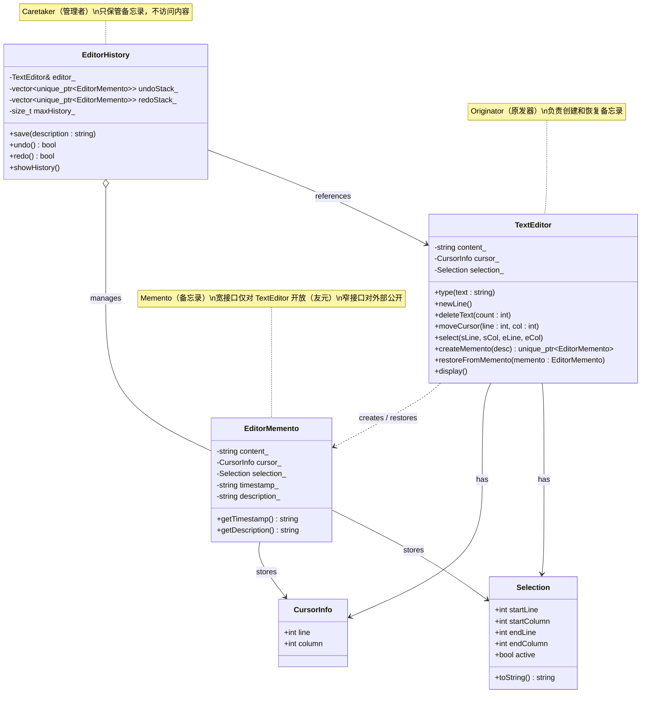
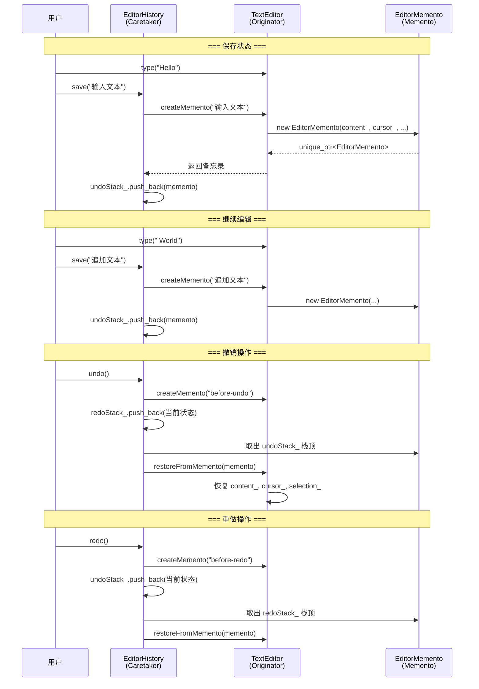

## 模式分类

> 备忘录模式属于 **"状态变化"** 分类。该分类关注的核心问题是：对象在运行时其内部状态会不断变化，如何在保持封装性的前提下管理这些状态的保存与恢复？备忘录模式通过将状态快照外部化存储，使得对象可以在不暴露实现细节的情况下回到先前的状态。

## 问题背景

> 在文本编辑器中，用户输入文本、移动光标、选中内容等操作会不断改变编辑器的内部状态。用户期望能够使用 **Ctrl+Z（撤销）** 和 **Ctrl+Y（重做）** 来回退或重放操作。
>
> 直觉的做法是让外部代码直接访问编辑器的所有内部字段来保存和恢复状态。但这样做会：
> - **破坏封装性**：外部代码与编辑器的内部实现紧密耦合
> - **维护困难**：编辑器内部结构变化时，所有保存/恢复逻辑都需要同步修改
> - **安全隐患**：任何人都能修改保存的状态数据
>
> 我们需要一种机制，既能完整保存对象的内部状态，又不暴露其实现细节。

## 模式意图

> **GoF 原书定义**：在不破坏封装性的前提下，捕获一个对象的内部状态，并在该对象之外保存这个状态。这样以后就可将该对象恢复到原先保存的状态。
>
> **通俗解释**：备忘录模式就像游戏中的"存档/读档"功能。你可以在任意时刻保存游戏进度（创建备忘录），之后无论发生什么，都可以读取之前的存档（恢复备忘录）回到那个时刻的状态。存档文件对玩家来说是不透明的——你只知道它代表某个时刻的进度，但不需要（也不应该）了解里面具体存了哪些数据。

## 类图



## 时序图



## 要点解析

### 1. 窄接口与宽接口

备忘录模式的核心难点在于访问控制。`EditorMemento` 对外只暴露 `getTimestamp()` 和 `getDescription()` 等元信息（窄接口），而真正的状态数据（`content_`、`cursor_`、`selection_`）只有 `TextEditor` 通过友元机制才能访问（宽接口）。

```cpp
class EditorMemento {
public:
    std::string getTimestamp() const;     // 窄接口 - 外部可见
private:
    friend class TextEditor;              // 宽接口 - 仅 Originator 可访问
    std::string content_;
};
```

### 2. Caretaker 的职责边界

`EditorHistory` 只负责保管备忘录对象，**绝不查看或修改**其内部状态。它维护两个栈：
- `undoStack_`：保存历史状态，支持撤销
- `redoStack_`：保存被撤销的状态，支持重做

### 3. 撤销后新编辑的处理

当用户撤销后进行了新的编辑操作，重做栈应被清空。这与主流编辑器（VS Code、Word）的行为一致——因为历史分支已经改变，原来的"未来"不再有意义。

### 4. 内存管理策略

使用 `std::unique_ptr` 管理备忘录的生命周期，且设置 `maxHistory_` 上限防止内存无限增长。在实际应用中可能还需要考虑：
- 增量备忘录（只保存差异而非完整快照）
- 压缩存储
- 持久化到磁盘

### 5. 状态完整性

备忘录必须捕获对象的**完整状态**。本例中包含文本内容、光标位置和选区信息三个维度。遗漏任何一个维度都会导致恢复后的状态不一致。

## 示例代码说明

本示例以文本编辑器为场景，包含三个核心角色：

- **`TextEditor`（Originator）**：持有编辑器状态（文本内容、光标位置、选区），提供 `createMemento()` 和 `restoreFromMemento()` 方法。
- **`EditorMemento`（Memento）**：不可变的状态快照，构造函数为 private，只有 `TextEditor` 可以创建它。
- **`EditorHistory`（Caretaker）**：维护 undo/redo 两个栈，调用编辑器的备忘录接口来实现撤销和重做。

`main()` 函数演示了完整的工作流程：
1. 逐步输入文本并保存快照
2. 执行多次撤销，验证状态正确回退
3. 执行重做，验证状态正确恢复
4. 撤销后进行新编辑，验证重做栈被清空
5. 连续撤销直到栈空，验证边界处理

## 开源项目中的应用

| 项目 | 应用场景 |
|------|----------|
| **Qt Framework** | `QUndoStack` / `QUndoCommand` 实现了基于命令的撤销系统，每个 `QUndoCommand` 内部保存执行前的状态（本质上就是备忘录） |
| **LLVM** | `SaveAndRestore<T>` 工具类用于在编译过程中临时保存和恢复变量状态，是备忘录模式的轻量实现 |
| **Unreal Engine** | 事务系统（Transaction System）用于编辑器中的撤销/重做，通过 `FTransaction` 保存对象修改前的状态 |
| **LibreOffice** | `SfxUndoManager` 管理文档编辑的撤销历史，每个 `SfxUndoAction` 包含操作前后的状态快照 |
| **Git** | `git stash` 命令本质上是备忘录模式——保存当前工作区状态的快照，稍后可以恢复 |

## 适用场景与注意事项

### 适用场景
- **需要撤销/重做功能**：文本编辑器、图形编辑器、IDE
- **需要事务回滚**：数据库事务、批量操作的原子性保证
- **需要状态快照**：游戏存档、断点调试、配置备份
- **需要临时保存上下文**：编译器在不同优化 pass 之间保存/恢复 IR 状态

### 注意事项
- **内存开销**：每次保存都是完整状态的拷贝，对于大对象需考虑增量保存或写时复制（Copy-on-Write）
- **状态完整性**：必须保存所有相关状态，遗漏字段会导致恢复后行为异常
- **深拷贝问题**：如果状态中包含指针或引用，必须进行深拷贝而非浅拷贝

### 与其他模式的对比
| 模式 | 区别 |
|------|------|
| **Command** | Command 记录"做了什么操作"并通过反操作来撤销；Memento 记录"状态是什么"并通过快照来恢复。两者常配合使用。 |
| **Prototype** | Prototype 关注的是创建对象的副本，而 Memento 关注的是保存和恢复对象的内部状态 |
| **State** | State 模式管理状态的切换行为，Memento 管理状态的保存与恢复，关注点不同 |