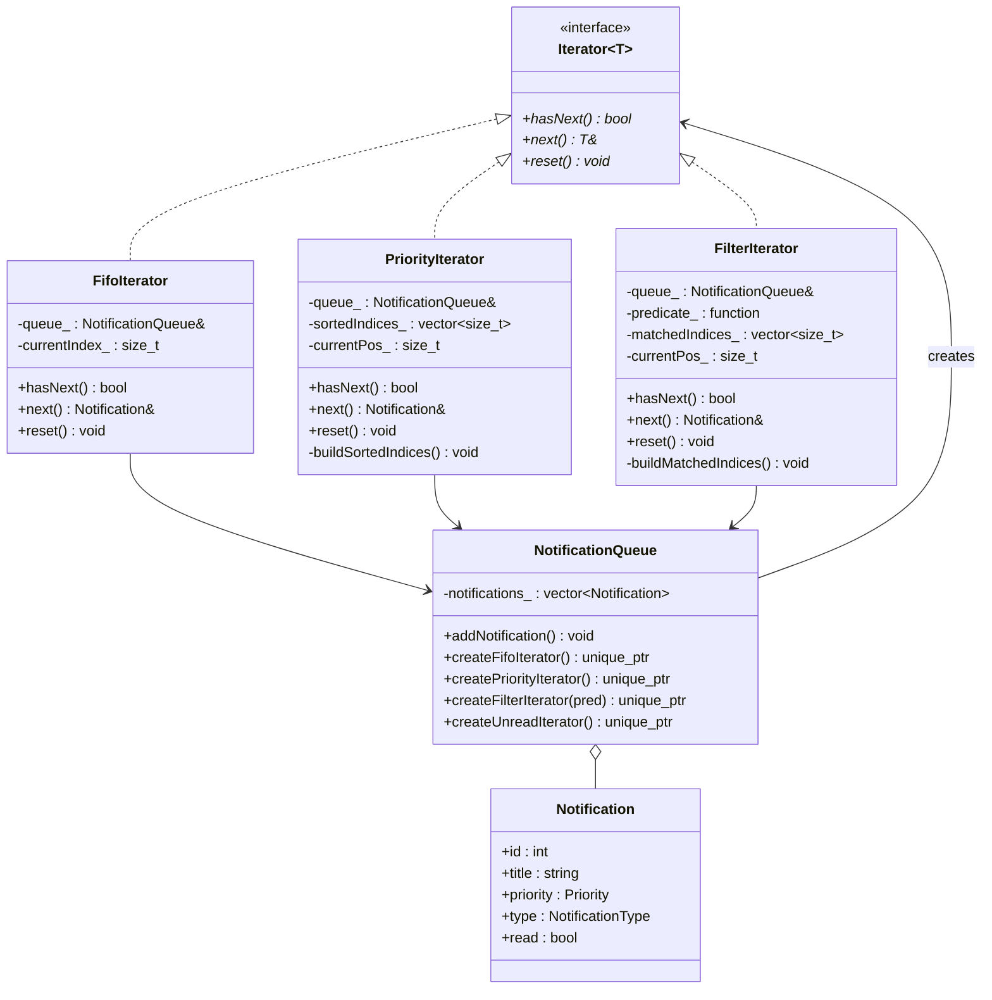
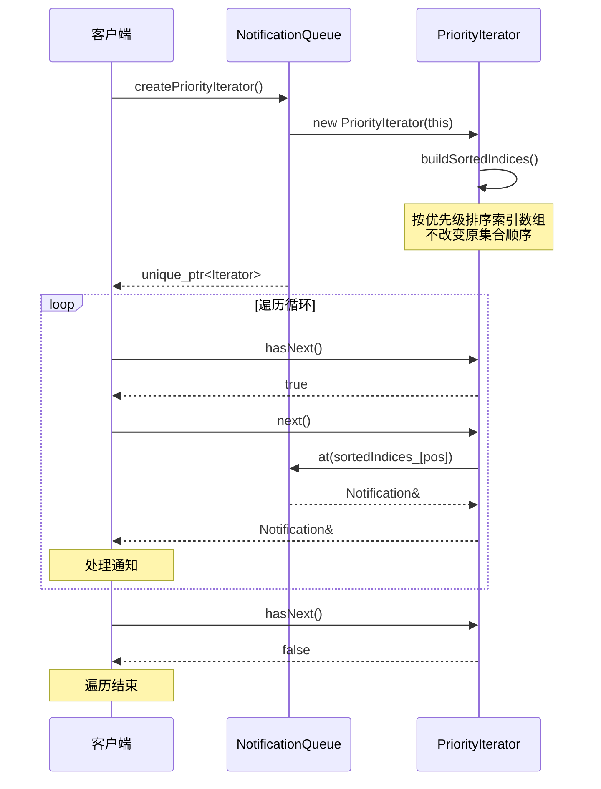

## 模式分类
> 归属于 **"数据结构"** 分类。迭代器模式的本质是为数据结构提供**统一的遍历协议**，将集合的内部存储表示与遍历算法解耦。无论底层是数组、链表、树还是图，客户端都通过同一个 `hasNext()`/`next()` 接口来访问元素。这是数据结构可用性的基础保障。

## 问题背景
> 在通知系统中，我们维护着一个通知队列，包含不同优先级（低、普通、高、紧急）和不同类型（系统、安全、业务、推广）的通知。运营人员需要按照不同的策略查看通知：
> - **FIFO**：按接收顺序处理
> - **优先级**：先处理紧急通知
> - **过滤**：只看安全类通知或只看未读通知
>
> 如果在集合类中为每种遍历方式写一个方法，集合类会越来越臃肿，且每新增一种遍历需求就要修改集合类。我们希望在**不改变集合**的前提下，灵活地添加新的遍历策略。

## 模式意图
> **GoF 定义：** 提供一种方法顺序访问一个聚合对象中的各个元素，而又不需暴露该对象的内部表示。
>
> **通俗解释：** 就像电视遥控器的"下一个频道"按钮——你不需要知道频道列表是怎么存储的（数组？链表？数据库？），只需要反复按"下一个"就能逐一浏览所有频道。而且你可以有不同的遥控器：一个按频道号顺序，一个按收藏夹顺序，一个只显示高清频道。

## 类图

## 时序图

## 要点解析

### 1. 内部迭代器 vs 外部迭代器
本实现采用**外部迭代器**（`hasNext()`/`next()` 由客户端驱动），这赋予客户端完全的遍历控制权——可以随时中断、跳过、或切换迭代器。C++ STL 的迭代器也是外部迭代器。内部迭代器（如 `std::for_each`）则由集合控制遍历过程。

### 2. 索引间接层 —— 不改变原集合
`PriorityIterator` 和 `FilterIterator` 都维护一个**索引数组**（`sortedIndices_`/`matchedIndices_`），而非复制或重排原始数据。这保证了：
- 原集合的顺序不受影响
- 多个迭代器可以同时工作而不互相干扰
- 内存开销仅为索引数组的大小

### 3. 谓词函数实现开放过滤
`FilterIterator` 接受 `std::function<bool(const Notification&)>` 作为过滤条件，利用 C++17 的函数对象和 lambda 表达式，客户端可以传入任意过滤逻辑，无需为每种条件创建新的迭代器子类。

### 4. 工厂方法封装创建逻辑
`NotificationQueue` 提供 `createXxxIterator()` 工厂方法，客户端通过基类指针 `Iterator<Notification>` 使用迭代器，不依赖具体迭代器类型。新增遍历策略时只需添加新的迭代器类和对应的工厂方法。

## 示例代码说明

### Iterator.h
定义了完整的迭代器体系：
- `Iterator<T>`：模板抽象接口，可复用于任何元素类型
- `FifoIterator`：按插入顺序遍历
- `PriorityIterator`：按优先级降序遍历
- `FilterIterator`：按谓词函数过滤遍历
- `NotificationQueue`：聚合类，提供迭代器工厂方法

### Iterator.cpp
演示了八种使用场景：
1. **FIFO 遍历**：按添加顺序查看所有通知
2. **优先级遍历**：Critical 优先，同级别保持 FIFO
3. **类型过滤**：只查看安全类通知
4. **优先级过滤**：只查看高优先级和紧急通知
5. **未读过滤**：标记部分已读后，遍历未读通知
6. **组合过滤**：未读 + 高优先级的复合条件
7. **迭代器重置**：演示 `reset()` 重新遍历
8. **聚合统计**：利用迭代器进行数据统计

## 开源项目中的应用

| 项目 | 应用场景 |
|------|----------|
| **C++ STL** | 所有容器都通过迭代器访问：`vector::iterator`、`map::iterator` 等，是迭代器模式最经典的实现 |
| **Boost.Range** | 提供范围适配器（filter、transform、reverse），本质是迭代器的高级封装 |
| **Java Collections** | `Iterator`/`ListIterator` 接口，`Iterable` 配合 for-each 循环 |
| **LLVM** | `inst_iterator` 遍历函数中的所有指令，`pred_iterator`/`succ_iterator` 遍历基本块的前驱/后继 |
| **Qt** | `QListIterator`、`QMapIterator` 等 Java 风格迭代器，以及 STL 风格的 `begin()`/`end()` |

## 适用场景与注意事项

### 适用场景
- 需要对同一个集合提供**多种遍历方式**
- 需要**统一的遍历接口**，隐藏集合的内部实现
- 需要支持**并发遍历**（多个迭代器独立工作）
- 遍历逻辑可能**频繁变化或扩展**

### 不适用场景
- 集合结构极简单（如固定长度数组），直接用下标访问更高效
- 只需要一种遍历方式且不会变化——过度设计
- 遍历过程中需要频繁修改集合——迭代器可能失效（需要额外的失效检测机制）

### 与其他模式的对比
| 对比模式 | 关系 |
|----------|------|
| **组合模式（Composite）** | 组合模式定义树形结构，迭代器提供对树的各种遍历方式（深度优先、广度优先等） |
| **工厂方法（Factory Method）** | 集合类中创建迭代器的方法本身就是工厂方法的应用 |
| **策略模式（Strategy）** | `FilterIterator` 的谓词函数类似策略模式，将过滤算法参数化 |
| **访问者模式（Visitor）** | 迭代器控制遍历顺序，访问者定义对每个元素的操作，两者可配合使用 |
