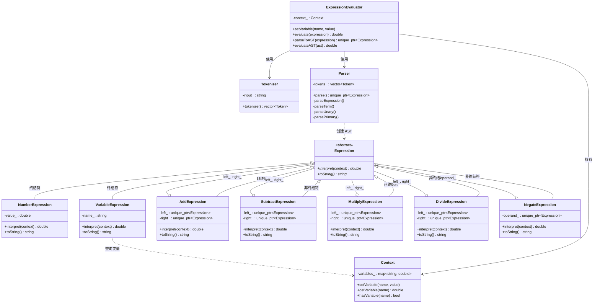

## 模式分类

> **归属于"领域问题"分类。**
>
> 在李建忠老师提出的"封装变化"分类法中，解释器模式是唯一归入"领域问题"类别的模式。原因在于：其他 22 种模式解决的是通用的面向对象设计问题（对象创建、结构组合、行为分派等），而解释器模式专门解决**一类特定领域的问题**——当你需要为某个领域定义一门小型语言（DSL），并为该语言编写解释执行引擎时，解释器模式提供了标准的结构化方案。
>
> 它封装的"变化"是**领域语法规则的变化**：当文法规则扩展（新增运算符、语句类型等）时，只需新增一个 Expression 子类，而不必修改现有的解释逻辑。

## 问题背景

假设你在开发一个规则引擎或报表系统，用户需要输入数学公式来定义计算规则，例如：

```
price * quantity - discount
(base_salary + bonus) * tax_rate
3 + 5 * (2 - 1)
```

如果用硬编码的方式为每种公式写一个计算函数，那么：
- 每次用户需要新公式时，都要修改代码、重新编译
- 公式的种类是无穷的，不可能穷举
- 复杂嵌套表达式难以用简单的 if-else 处理

**核心矛盾**：我们需要一种通用机制来解析和执行用户定义的表达式，而不是为每种表达式写死计算逻辑。

## 模式意图

> **GoF 原书定义**：给定一个语言，定义它的文法的一种表示，并定义一个解释器，这个解释器使用该表示来解释语言中的句子。
>
> **通俗解释**：将一门小语言（如数学表达式）的语法规则映射为类的继承体系——每条文法规则对应一个类，表达式被解析成一棵由这些类实例组成的树（AST），然后通过递归遍历这棵树来"执行"表达式。

关键思想：**文法规则 = 类层次结构，语句 = 对象树，解释 = 递归求值**。

## 类图



## 时序图

```mermaid
sequenceDiagram
    participant Client as 客户端
    participant Eval as ExpressionEvaluator
    participant Tok as Tokenizer
    participant Par as Parser
    participant AST as AST (Expression树)
    participant Ctx as Context

    Note over Client, Ctx: 阶段一：设置上下文（变量绑定）
    Client->>Eval: setVariable("x", 10)
    Eval->>Ctx: setVariable("x", 10)

    Note over Client, Ctx: 阶段二：解析表达式 "x + 3 * 2"
    Client->>Eval: evaluate("x + 3 * 2")
    Eval->>Tok: tokenize("x + 3 * 2")
    Tok-->>Eval: [ID:x, +, NUM:3, *, NUM:2, END]
    Eval->>Par: parse(tokens)
    Note right of Par: 递归下降解析：<br/>parseExpression()<br/>→ parseTerm()<br/>→ parsePrimary()
    Par-->>Eval: AST 根节点 (AddExpr)

    Note over Client, Ctx: 阶段三：递归求值 AST
    Eval->>AST: interpret(context)
    Note right of AST: AddExpr.interpret()

    AST->>AST: left→interpret() [VariableExpr "x"]
    AST->>Ctx: getVariable("x")
    Ctx-->>AST: 10

    AST->>AST: right→interpret() [MultiplyExpr]
    AST->>AST: left→interpret() [NumberExpr 3]
    AST-->>AST: 3
    AST->>AST: right→interpret() [NumberExpr 2]
    AST-->>AST: 2
    AST-->>AST: 3 * 2 = 6

    AST-->>Eval: 10 + 6 = 16
    Eval-->>Client: 16
```

## 要点解析

### 1. 终结符与非终结符的区分

解释器模式的核心是将文法规则映射为类：

- **终结符表达式**（Terminal Expression）：不能再分解的最小单元，如 `NumberExpression`（数字 `3`）和 `VariableExpression`（变量 `x`）。它们是 AST 的叶子节点。
- **非终结符表达式**（Non-terminal Expression）：由更小的表达式组合而成，如 `AddExpression` 表示 `左操作数 + 右操作数`。它们是 AST 的内部节点，持有子表达式的指针。

### 2. 递归求值是模式的灵魂

`interpret()` 方法在非终结符节点上递归调用子节点的 `interpret()`，最终在终结符节点上返回具体值。整棵 AST 的求值就是一次**深度优先遍历**。这种递归结构与 Composite 模式高度相似——事实上，解释器模式可以看作是 Composite 模式在"语言解释"这一特定领域的应用。

### 3. Context 的作用

Context 将"环境信息"（如变量值）与 AST 结构分离。同一棵 AST 可以在不同的 Context 下求值得到不同结果，例如：
- `x * x + y * y` 在 `{x=3, y=4}` 下求值为 25
- 同一棵树在 `{x=5, y=12}` 下求值为 169

### 4. 运算符优先级通过文法层次实现

在本实现中，运算符优先级不是通过显式的优先级数值来处理的，而是通过**文法规则的层次结构**自然体现的：

```
expression  = term (('+' | '-') term)*      ← 加减：最低优先级
term        = unary (('*' | '/') unary)*     ← 乘除：较高优先级
unary       = '-' unary | primary            ← 一元负号
primary     = NUMBER | IDENTIFIER | '(' expression ')'  ← 最高优先级
```

低优先级运算符在外层解析，高优先级在内层。这样解析时先深入到高优先级，自然形成了正确的 AST 结构。

### 5. 内存管理与所有权

使用 `std::unique_ptr<Expression>` 管理 AST 节点的生命周期：
- 父节点**拥有**子节点（独占所有权）
- AST 被销毁时，节点自动按后序遍历释放
- `std::move` 语义确保所有权的安全转移

## 示例代码说明

本目录下的 `Interpreter.h` / `Interpreter.cpp` 实现了一个完整的数学表达式求值器，包含以下层次：

### 角色映射

| 解释器模式角色 | 代码中的类 | 说明 |
|---|---|---|
| AbstractExpression | `Expression` | 抽象基类，定义 `interpret()` 接口 |
| TerminalExpression | `NumberExpression`, `VariableExpression` | AST 叶节点 |
| NonterminalExpression | `AddExpression`, `SubtractExpression`, `MultiplyExpression`, `DivideExpression`, `NegateExpression` | AST 内部节点 |
| Context | `Context` | 存储变量名到值的映射 |
| Client | `ExpressionEvaluator`, `main()` | 构建 AST 并触发求值 |

### 文法定义

```
expression  → term (('+' | '-') term)*
term        → unary (('*' | '/') unary)*
unary       → '-' unary | primary
primary     → NUMBER | IDENTIFIER | '(' expression ')'
```

### 求值流程

1. **Tokenizer** 将字符串 `"3 + 5 * (2 - 1)"` 拆分为 Token 序列
2. **Parser** 按文法规则递归下降解析，构建 AST
3. **interpret()** 递归遍历 AST 求值，VariableExpression 从 Context 查找变量值

### 演示内容

`main()` 函数展示了 8 个演示场景：
- 基本算术运算
- 运算符优先级和括号
- 带变量的表达式
- 同一 AST 在不同 Context 下求值
- 一元负号
- 复杂嵌套表达式
- 错误处理（除零、未定义变量、语法错误）
- 手动构建 AST（不经过 Parser）

## 开源项目中的应用

### Boost.Spirit

Boost.Spirit 是 C++ 中最著名的解释器模式应用之一。它使用 C++ 模板元编程将 EBNF 文法直接嵌入 C++ 代码中，编译期生成解析器。每条文法规则对应一个模板类实例，组合方式与本示例的 Expression 继承体系在概念上完全对应。

### ANTLR

ANTLR（Another Tool for Language Recognition）是一个强大的语法分析器生成器。用户定义文法文件（`.g4`），ANTLR 自动生成 Lexer 和 Parser 代码。生成的 Parser 构建的 Parse Tree 本质上就是解释器模式中的 AST，而 Visitor/Listener 接口则是 `interpret()` 的变体。

### LLVM

LLVM 的前端 Clang 在解析 C/C++ 源代码时，构建的 AST（`clang::Expr` 及其子类如 `BinaryOperator`、`IntegerLiteral`）与解释器模式的结构高度吻合。`Expr::EvaluateAsInt()` 等方法就是在 AST 上进行常量表达式求值——这正是解释器模式的直接应用。

### 正则表达式引擎

`std::regex` 和各种正则表达式库的内部实现都遵循解释器模式：正则语法被解析为 NFA/DFA 节点树，匹配过程就是在该树上的递归解释执行。

### 规则引擎（如 Drools、EasyRules）

企业级规则引擎将业务规则表示为 DSL，解析后生成规则对象树，在运行时对事实（Context）进行解释求值。

## 适用场景与注意事项

### 适用场景

1. **语法简单且相对稳定的 DSL**：文法规则不多（通常十几条以内），且不频繁变动
2. **效率不是首要考量**：解释器模式的递归遍历效率较低，适合执行频率不高的场景（如配置解析、规则评估）
3. **需要灵活扩展的语法**：新增运算符或语句类型只需添加一个 Expression 子类

### 不适用场景

1. **复杂文法**：当文法规则超过几十条时，Expression 子类爆炸，维护困难。此时应使用专业的语法分析器生成工具（ANTLR、Bison、Boost.Spirit）
2. **高性能要求**：递归遍历 AST 的效率远低于编译为字节码或机器码。对性能敏感的场景应考虑 JIT 编译
3. **需要复杂错误恢复**：简单的递归下降解析器难以提供友好的错误信息和错误恢复机制

### 与其他模式的关系

| 对比模式 | 关系 |
|---|---|
| **Composite** | 解释器模式的 AST 就是 Composite 结构——终结符是叶节点，非终结符是组合节点。可以说解释器模式是 Composite 模式在"语言解释"领域的特化 |
| **Visitor** | 当需要对 AST 执行多种不同操作（求值、类型检查、优化、代码生成）时，可以用 Visitor 模式替代 `interpret()` 方法，将操作与结构分离 |
| **Flyweight** | 对于终结符表达式（如同一个变量名被多次引用），可以用 Flyweight 模式共享实例，减少内存开销 |
| **Iterator** | 对 AST 的遍历可以用 Iterator 抽象化，例如前序/中序/后序遍历 |
| **Strategy** | 如果 `interpret()` 的行为需要动态切换（如从"求值"切换为"格式化输出"），可以将其封装为 Strategy |
